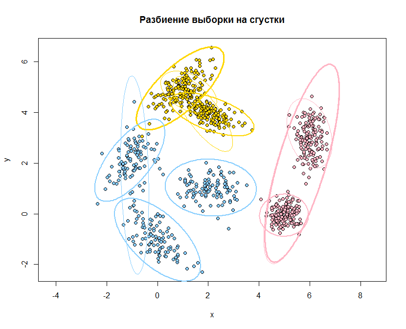
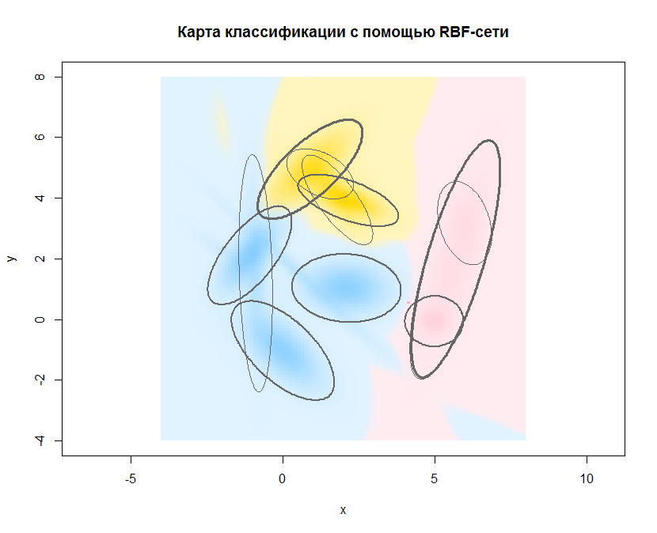

[К меню](https://github.com/Inc1ementia/ML1)

# Метод Expectation-Maximization

*Байесовский подход* является классическим в теории распознавания образов и лежит в основе многих методов. Он опирается на теорему о том, что если плотности распределения классов известны, то алгоритм классификации, имеющий минимальную вероятность ошибок, можно выписать в явном виде.

На практике плотности распределения классов, как правило, не известны. Их приходится оценивать (восстанавливать) по обучающей выборке. В результате байесовский алгоритм перестаёт быть оптимальным, так как восстановить плотность по выборке можно только с некоторой погрешностью. Чем короче выборка, тем выше шансы подогнать распределение под конкретные данные и столкнуться с эффектом переобучения.

ЕМ-алгоритмом (expectation-maximization) принято называть довольно работоспособную схему построения процедур итерационного типа для численного решения задачи поиска экстремума целевой функции в разнообразных задачах оптимизации. В частности, в прикладной статистике эта схема довольно эффективна для поиска оценок максимального правдоподобия и родственных им в ситуациях, когда функция правдоподобия имеет сложную структуру, из-за которой другие методы оказываются неэффективными или вообще не применимыми.

EM-алгоритм состоит из итерационного повторения двух шагов. На E-шаге вычисляется ожидаемое значение (expectation) вектора скрытых переменных G по текущему приближению вектора параметров Θ. На М-шаге решается задача максимизации правдоподобия (maximization) и находится следующее приближение вектора Θ по текущим значениям векторов G и Θ.

E-шаг (expectation):


M-шаг (maximization): 


### Программная реализация алгоритма

```R
RBFClassifier <- function(x,theta,lambda) {   #классификация RBF-сетью
  k <- dim(theta)[1]
  s <- length(lambda)   #число классов
  classes <- rep(0.0,s)
  for (j in 1:k) {   #для каждого класса считаем значение второго слоя сети
    mu <- matrix(theta[j,3:4],1,2)
    sigma <- matrix(theta[j,5:8],2,2)
    classes[theta[j,1]] <- classes[theta[j,1]]+phi(x,mu,sigma)*theta[j,2]   #переход от первого слоя сети ко второму
  }
  classes <- classes*lambda*Pi   #третий слой сети
  return (classes)
}


RBF <- function(xl,R,m0,delta) {
  l <- dim(xl)[1]
  n <- dim(xl)[2]-1
  vars <- as.integer(names(table(xl[ ,n+1])))   #список имеющихся классов
  theta <- numeric()
  Pi <<- rep(0,length(vars))
  for (i in 1:length(vars)) {
    xli <- xl[which(xl[ ,n+1]==vars[i],arr.ind=TRUE), ]   #выбираем только точки данного класса
    Pi[i] <<- dim(xli)[1]
    theta <- rbind(theta,cbind(vars[i],EMDinamic(xli,R,m0,delta)))    #для очередного класса запускаем EM-алгоритм
  }
  return (theta)
}


EMDinamic <- function(xl,R,m0,delta) {
  k <- 1
  l <- dim(xl)[1]
  n <- dim(xl)[2]-1
  gPrev <<- matrix(0.0,l,k)
  g <<- gPrev
  g[ ,1] <<- rep(1.0,l)    #исходно все точки принадлежат первому подмножеству
  theta <- matrix(0.0,k,n*n+n+1)
  mu <- muHat(xl)   #инициализация mu и sigma
  sigma <- sigmaHat(xl,mu)
  theta[1, ] <- c(1.0,c(mu),c(sigma))
  while (k<7) {
    prob <- matrix(0.0,l)
    w <- theta[ ,1]
    mu <- theta[ ,2:(n+1)]
    sigma <- theta[ ,(n+2):(n*n+n+1)]
    if (k==1) {   #на первом шаге нужно ещё не массивная структура - принудительное построение массивов
      w <- matrix(w,1,1)
      mu <- matrix(mu,1,length(mu))
      sigma <- matrix(sigma,1,length(sigma))
    }
    for (j in 1:k) {
      for (i in 1:l) {
        prob[i] <- prob[i]+w[j]*phi(xl[i,1:n],mu[j, ],sigma[j, ])   #подсчёт вероятностей каждого из объектов
      }
    }
    probMax <- max(prob)/R
    U <- which(prob<probMax)   #множество U плоховыделимых объектов
    if (length(U)<m0) break   #если объектов достаточно мало, то можно выходить
    theta <- rbind(theta,rep(0,n*n+n+1))
    k <- k+1
    theta[k,1] <- length(U)/l
    for (i in 1:(k-1)) {
      theta[i,1] <- theta[i,1]*(1-theta[k,1])   #пересчёт весов подмножеств
    }
    g <<- cbind(g,rep(0.0,l))
    g[U, ] <<- rep(0.0,k)
    g[U,k] <<- 1.0
    theta[k,2:(n+1)] <- c(muHat(xl,k,theta[k,1]))   #значение mu для нового подмножества
    theta[k,(n+2):(n*n+n+1)] <- c(sigmaHat(xl,matrix(theta[k,2:(n+1)],1,n),k,theta[k,1]))   #значение sigma для нового подмножества
    theta <- EMfixedK(xl,k,theta,delta)
  }
  return (theta)
}


EMfixedK <- function(xl,k,theta,delta) {
  l <- dim(xl)[1]
  n <- dim(xl)[2]-1
  steps <- 0
  w <- theta[ ,1]
  mu <- theta[ ,2:(n+1)]
  sigma <- theta[ ,(n+2):(n*n+n+1)]
  while (TRUE) {
    steps <- steps+1
    #E-шаг
    gPrev <<- g   #сохраняется таблица скрытых параметров g
    for (i in 1:l) {
      sm <- 0.0
      for (s in 1:k) {
        sm <- sm+w[s]*phi(xl[i,1:n],mu[s, ],sigma[s, ])   #подсчёт знаменателя
      }
      for (j in 1:k) {
        g[i,j] <<- w[j]*phi(xl[i,1:n],mu[j, ],sigma[j, ])/sm   #пересчёт скрытых коэффициентов g
      }
    }
    #M-шаг
    for (j in 1:k) {
      w[j]<- sum(g[ ,j])/l   #пересчёт весов компонент
      mu[j, ] <- muHat(xl,j,w[j])   #пересчёт mu для каждой компоненты
      ss <- sigmaHat(xl,matrix(mu[j, ],1,2),j,w[j])   #пересчёт sigma для каждой компоненты
      if (det(matrix(ss,2,2))<1e-9) {   #если очень плохая матрица - лучше закончить процесс...
        break;
      }
      sigma[j, ] <- c(ss)
    }
    gg <- max(g-gPrev)   #определение останова алгоритма
    if (gg<=delta) break
  }
  for (j in 1:k) {
    theta[j, ] <- c(w[j],mu[j, ],sigma[j, ])
  }
  return (theta)
}

##################

main <- function(lambda) {
  colors <- c("pink1","gold","skyblue1")
  mu1 <- c(5,0)
  mu2 <- c(6,3)
  mu3 <- c(2,4)
  mu4 <- c(-1,2)
  mu5 <- c(0,-1)
  mu6 <- c(1,5)
  mu7 <- c(2,1)
  sigma1 <- matrix(c(1,0,0,1)/10,2,2)
  sigma2 <- matrix(c(1,0,0,5)/10,2,2)
  sigma3 <- matrix(c(3,-1,-1,1)/10,2,2)
  sigma4 <- matrix(c(2,1,1,5)/10,2,2)
  sigma5 <- matrix(c(4,-2,-2,3)/10,2,2)
  sigma6 <- matrix(c(3,2,2,3)/10,2,2)
  sigma7 <- matrix(c(4,0,0,2)/10,2,2)
  xl1 <- mvrnorm(150,mu1,sigma1)
  xl2 <- mvrnorm(150,mu2,sigma2)
  xl3 <- mvrnorm(150,mu3,sigma3)
  xl4 <- mvrnorm(100,mu4,sigma4)
  xl5 <- mvrnorm(100,mu5,sigma5)
  xl6 <- mvrnorm(150,mu6,sigma6)
  xl7 <- mvrnorm(100,mu7,sigma7)
  xl <- rbind(cbind(xl1,1),cbind(xl2,1),cbind(xl3,2),cbind(xl4,3),cbind(xl5,3),cbind(xl6,2),cbind(xl7,3))
  theta <- RBF(xl,7,5,0.05)
  message <- "Разбиение выборки на сгустки"
  plot(xl[ ,1],xl[ ,2],pch=21,col="black",bg=colors[xl[ ,3]],asp=1,main=message,xlab="x",ylab="y")
  k <- dim(theta)[1]
  x <- seq(-8,8,by=0.05)
  y <- x
  for (i in 1:k) {   #для каждого подможества строим линию уровня, увеличивая толщину линии в зависимости от значимости
    mu <- matrix(theta[i,3:4],1,2)
    sigma <- matrix(theta[i,5:8],2,2)
    sick <- 1
    if (theta[i,2]>0.2) sick <- 2
    if (theta[i,2]>0.4) sick <- 3
    if (theta[i,2]>=0.05)
      contour(x,y,levelLine(mu,sigma,x,y),lwd=sick,col=colors[theta[i,1]],asp=1,levels=0.01,drawlabels=FALSE,add=TRUE)
  }
  message <- "Карта классификации с помощью RBF-сети"
  x <- seq(-4,8,by=0.1)
  y <- x
  xx <- rep(-4,length(x)-1)
  stpX <- (x[2]-x[1])
  xx[1] <- xx[1]+stpX/2
  for (i in 2:length(xx))
    xx[i] <- xx[i-1]+stpX
  yy <- xx
  dat <- array(NA,c(length(xx),length(yy),3))
  res <- matrix(NA,length(xx),length(yy))
  a <- 1
  maxProb <- c(0.0,0.0,0.0)
  for (i in xx) {   #для каждой точки графика определяются результаты работы РБФ-сети
    print(i)
    b <- 1
    for (j in yy) {
      class <- RBFClassifier(c(i,j),theta,lambda)
      sm <- sum(class)
      dat[a,b, ] <- class
      q <- which.max(class)
      if (maxProb[q]<class[q]) maxProb[q] <- class[q]
      b <- b+1
    }
    a <- a+1
  }
  a <- 1   #для всех клеток определяется яркость в зависимости от доминирующего класса
  for (i in xx) {
    b <- 1
    for (j in yy) {
      sm <- dat[a,b, ]
      q <- which.max(sm)
      sm <- sm/sum(sm)   #данные отображаются на отрезок [0,1]
      redRatio <- min(sum(sm*c(255,255,135))/255,1.0)
      greenRatio <- min(sum(sm*c(181,215,206))/255,1.0)
      blueRatio <- min(sum(sm*c(197,0,255))/255,1.0)
      res[a,b] <- rgb(redRatio,greenRatio,blueRatio,0.25+0.75*sqrt(dat[a,b,q]/maxProb[q]))
      #функция sqrt взята как более быстрорастущая, чем линейная, тем самым даже средней значимости точки будут ярче
      b <- b+1
    }
    a <- a+1
  }
  plot(0,0,type="n",xlim=c(-4,8),ylim=c(-4,8),xlab="x",ylab="y",main=message,asp=1)
  for (i in 2:length(x))
    for (j in 2:length(y)) {
      coors <- c(x[i-1],y[j-1],x[i],y[j])
      rect(coors[1],coors[2],coors[3],coors[4],col=res[i-1,j-1],border=NA)
    }
  x <- seq(-4,8,by=0.05)
  y <- x
  for (i in 1:k) {   #для каждого подможества строим линию уровня, увеличивая толщину линии в зависимости от значимости
    mu <- matrix(theta[i,3:4],1,2)
    sigma <- matrix(theta[i,5:8],2,2)
    sick <- 1
    if (theta[i,2]>0.2) sick <- 2
    if (theta[i,2]>0.4) sick <- 3
    if (theta[i,2]>=0.05)
      contour(x,y,levelLine(mu,sigma,x,y),lwd=sick,col="gray40",asp=1,levels=0.01,drawlabels=FALSE,add=TRUE)
  }
}
```

### Результат работы алгоритма

Результатом работы алгоритма будут следующие графики:





[К меню](https://github.com/Inc1ementia/ML1)
