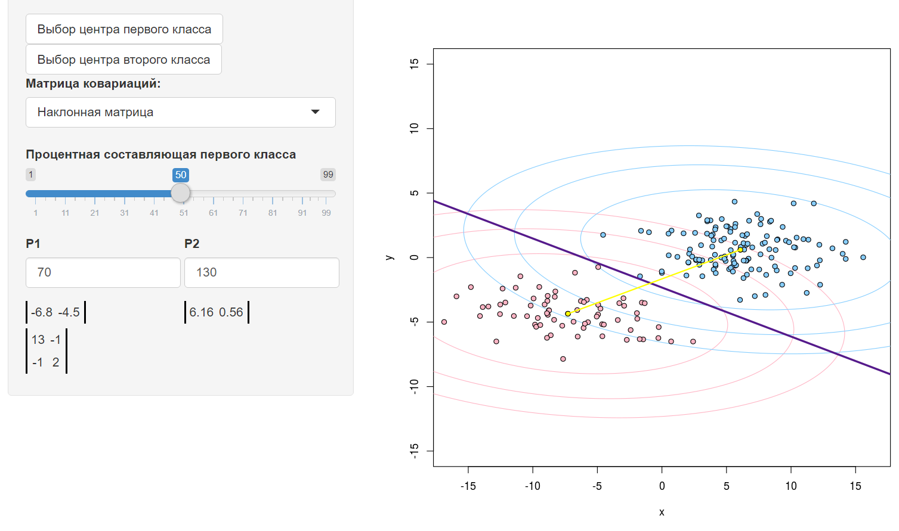

[К меню](https://github.com/Inc1ementia/ML1)

# Метод линейного дискриминанта Фишера

*Байесовский подход* является классическим в теории распознавания образов и лежит в основе многих методов. Он опирается на теорему о том, что если плотности распределения классов известны, то алгоритм классификации, имеющий минимальную вероятность ошибок, можно выписать в явном виде.

На практике плотности распределения классов, как правило, не известны. Их приходится оценивать (восстанавливать) по обучающей выборке. В результате байесовский алгоритм перестаёт быть оптимальным, так как восстановить плотность по выборке можно только с некоторой погрешностью. Чем короче выборка, тем выше шансы подогнать распределение под конкретные данные и столкнуться с эффектом переобучения.

Линейный дискриминант Фишера в первоначальном значении - метод, определяющий расстояние между распределениями двух разных классов объектов или событий. Предположим, что обучающая выборка удовлетворяет помимо базовых гипотез байесовского классификатора также следующим гипотезам: классы распределены по нормальному закону и матрицы ковариаций классов равны Такой случай соответствует наилучшему разделению классов по дискриминанту Фишера (в первоначальном значении). Тогда статистический подход приводит к линейному дискриминанту, и именно этот алгоритм классификации в настоящее время часто понимается под термином линейный дискриминант Фишера.


Он неплохо работает, когда формы классов действительно близки к нормальным и не слишком сильно различаются. В этом случае линейное решающее правило близко к оптимальному байесовскому, но существенно более устойчиво, чем квадратичное, и часто обладает лучшей обобщающей способностью. Вероятность ошибки линейного дискриминанта Фишера выражается через расстояние Махаланобиса между классами, в случае, когда классов два:


### Программная реализация алгоритма

```R
getLevelLine <- function(mu,sigma) {  #получение коэффициентов линии уровня (x-mu)^T %*% Sig^-1 %*% (x-mu)
  invSigma <- solve(sigma)
  a <- invSigma[1,1]
  b <- invSigma[1,2]+invSigma[2,1]
  c <- invSigma[2,2]
  d <- -2*mu[1]*invSigma[1,1]-mu[2]*b
  e <- -2*mu[2]*invSigma[2,2]-mu[1]*b
  f <- invSigma[1,1]*mu[1]^2+invSigma[2,2]*mu[2]^2+mu[1]*mu[2]*b
  return (c(a,b,c,d,e,f))
}
  
  
levelLine <- function(mu,sigma,x,y,levelColor) {    #построение линии уровня
  coeffs <- getLevelLine(mu,sigma)
  z <- outer(x,y,function(x,y) {coeffs[1]*x^2+coeffs[2]*x*y+coeffs[3]*y^2+coeffs[4]*x+coeffs[5]*y+coeffs[6]})
  contour(x,y,z,levels=c(5,10,15),drawlabels=FALSE,lwd=1,col=levelColor,add=TRUE)
  points(mu[1],mu[2],pch=19,bg=levelColor,asp=1)
}
  
  
linearFisher <- function(mu1,mu2,sigma,lambda1,lambda2) {    #построение разделяющей прямой Фишера
  invSigma <- solve(sigma);
  alpha <- invSigma%*%t(mu1-mu2);
  muSt <- (mu1*lambda2+mu2*lambda1)*0.5;
  betta <- muSt%*%alpha;
  abline(betta/alpha[2,1],-alpha[1,1]/alpha[2,1],col=colors[4],lwd=3)
}
```

### Результат работы алгоритма с использованием [shiny](https://inc1ementia.shinyapps.io/fisherShiny/)

Результатом работы алгоритма будет следующий график:



[К меню](https://github.com/Inc1ementia/ML1)
