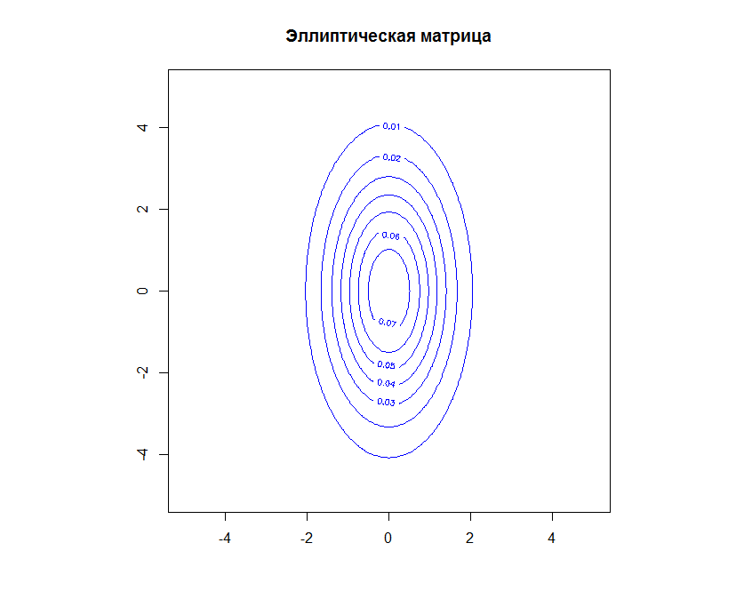
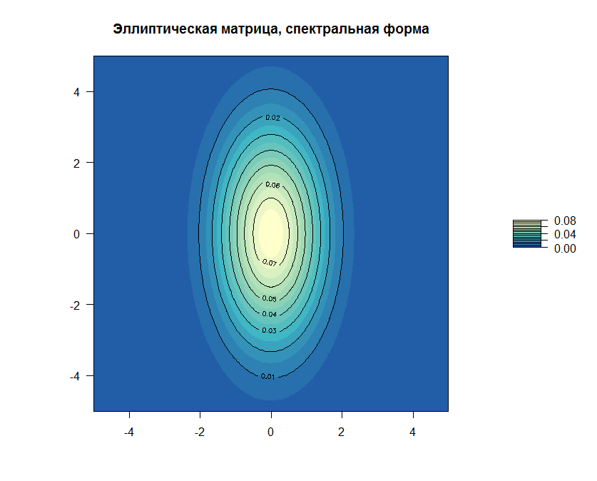
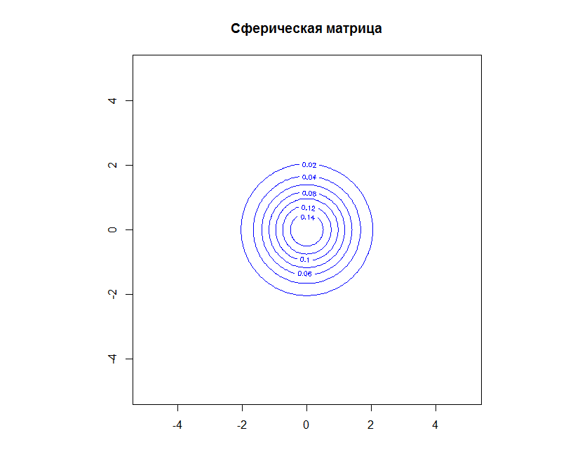
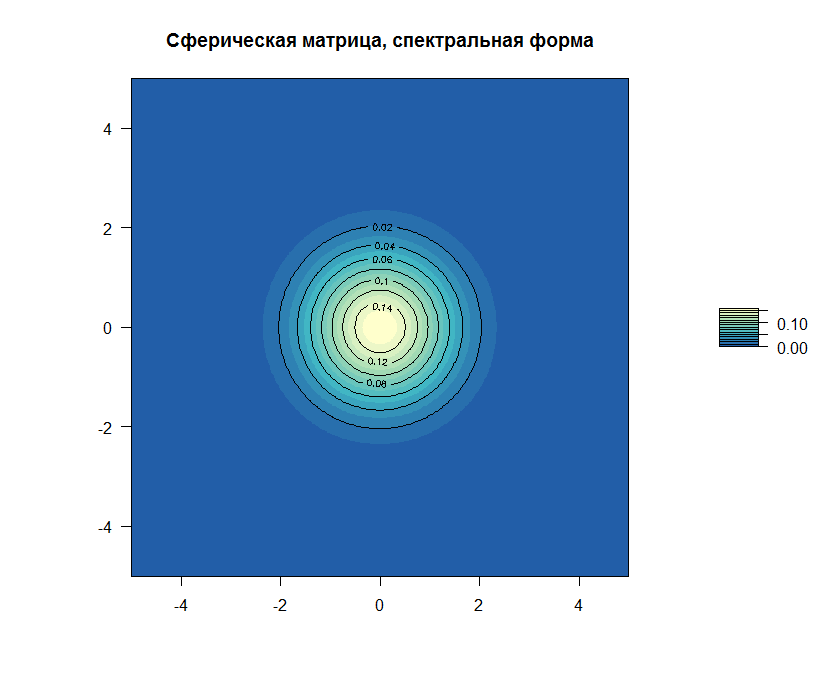
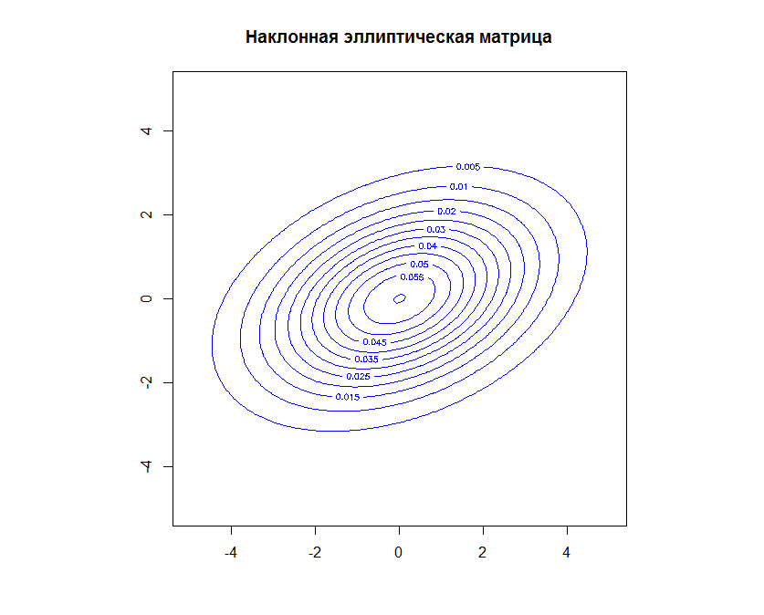
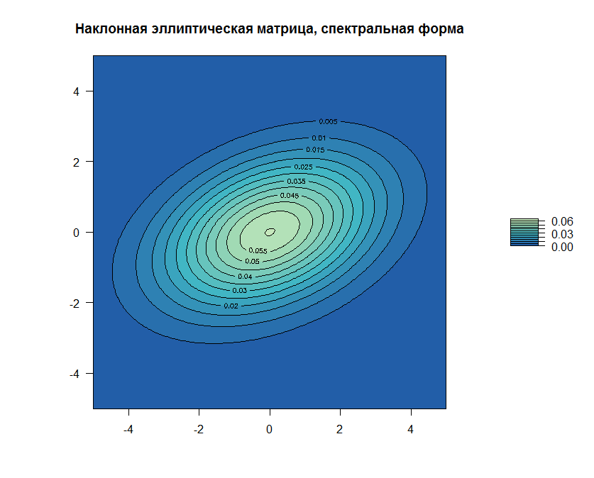
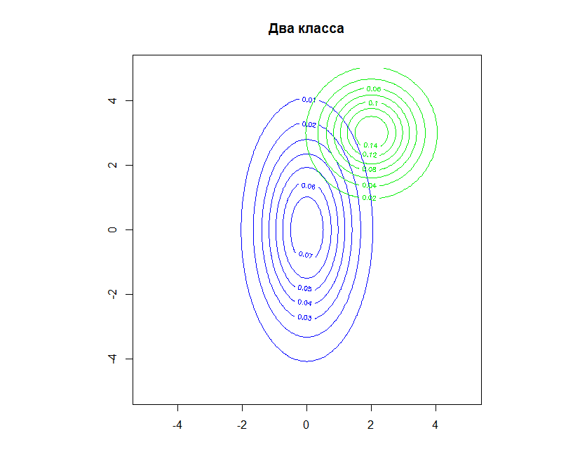
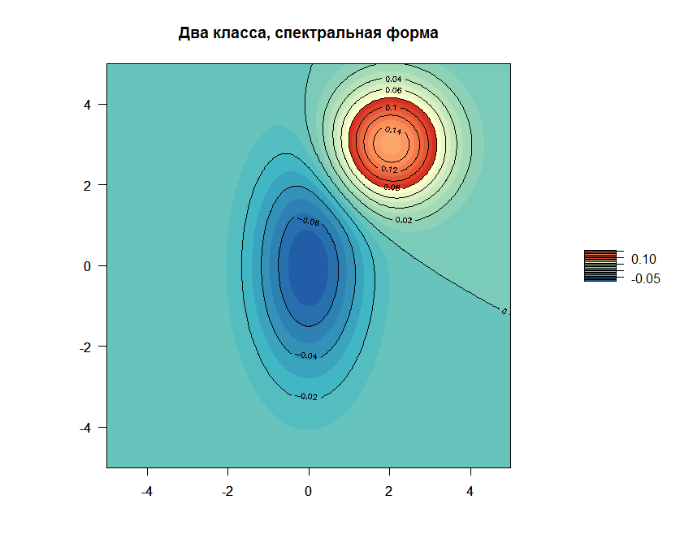

[К меню](https://github.com/Inc1ementia/ML1)

# Метод нормального дискриминантного анализа. Линии уровня

*Байесовский подход* является классическим в теории распознавания образов и лежит в основе многих методов. Он опирается на теорему о том, что если плотности распределения классов известны, то алгоритм классификации, имеющий минимальную вероятность ошибок, можно выписать в явном виде.

На практике плотности распределения классов, как правило, не известны. Их приходится оценивать (восстанавливать) по обучающей выборке. В результате байесовский алгоритм перестаёт быть оптимальным, так как восстановить плотность по выборке можно только с некоторой погрешностью. Чем короче выборка, тем выше шансы подогнать распределение под конкретные данные и столкнуться с эффектом переобучения.

Нормальный дискриминантный анализ — это специальный случай байесовской классификации, когда предполагается, что плотности всех классов являются многомерными нормальными. В этом случае задача оценивания параметров распределения по выборке решается аналитически.
### Программная реализация алгоритма

```R
getLevelLine <- function(mu,sigma) {  #получение коэффициентов линии уровня (x-mu)^T %*% Sig^-1 %*% (x-mu)
  invSigma <- solve(sigma)
  a <- invSigma[1,1]
  b <- invSigma[1,2]+invSigma[2,1]
  c <- invSigma[2,2]
  d <- -2*mu[1]*invSigma[1,1]-mu[2]*b
  e <- -2*mu[2]*invSigma[2,2]-mu[1]*b
  f <- invSigma[1,1]*mu[1]^2+invSigma[2,2]*mu[2]^2+mu[1]*mu[2]*b
  return (c(a,b,c,d,e,f))
}


levelLine <- function(mu,sigma,x,y) {    #построение линии уровня
  coeffs <- getLevelLine(mu,sigma)
  n <- function(X,Y) {
    return (1.0/(2*pi*sqrt(det(sigma)))*exp(-0.5*(X^2*coeffs[1]+X*Y*coeffs[2]+Y^2*coeffs[3]+X*coeffs[4]+Y*coeffs[5]+coeffs[6])))
  }
  return (outer(x,y,n))
}
```

### Результат работы алгоритма

Результатом работы алгоритма будут следующие графики:

















[К меню](https://github.com/Inc1ementia/ML1)
