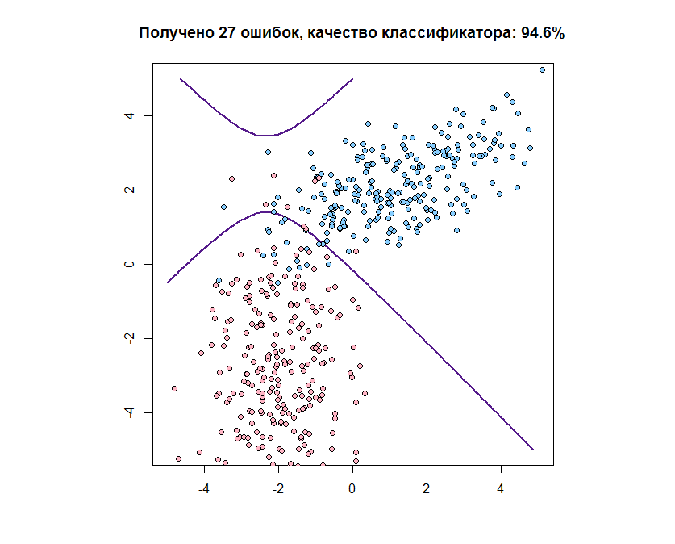

[К меню](https://github.com/Inc1ementia/ML1)

# Метод наивного нормального байесовского классификатора

*Байесовский подход* является классическим в теории распознавания образов и лежит в основе многих методов. Он опирается на теорему о том, что если плотности распределения классов известны, то алгоритм классификации, имеющий минимальную вероятность ошибок, можно выписать в явном виде.

На практике плотности распределения классов, как правило, не известны. Их приходится оценивать (восстанавливать) по обучающей выборке. В результате байесовский алгоритм перестаёт быть оптимальным, так как восстановить плотность по выборке можно только с некоторой погрешностью. Чем короче выборка, тем выше шансы подогнать распределение под конкретные данные и столкнуться с эффектом переобучения.

Наивный байесовский классификатор - специальный частный случай байесовского классификатора, основанный на дополнительном предположении, что объекты описываются статистически независимыми признаками. Пусть все признаки независимы и нормально распределены с матожиданием и дисперсией, вообще говоря, отличающимися для разных классов:


Тогда, как нетрудно убедиться, ковариационные матрицы и их выборочные оценки будут диагональны. В этом случае проблемы вырожденности и мультиколлинеарности не возникают.

### Программная реализация алгоритма

```R
muHat <- function(xl) {   #считаем значение мю по данным для класса
  n <- dim(xl)[2]
  mu <- array(NA,n)
  for (i in 1:n) {
    mu[i] <- mean(xl[ ,i])   #по каждой координате берём среднее
  }
  return (mu)
}


sigmaHat <- function(xl,mu) {   #считаем зачение сигма по данным для класса и полученному мю
  l <- dim(xl)[1]
  n <- dim(xl)[2]
  sigma <- matrix(0,n,n)
  for (i in 1:n) {
    sigma[i, ] <- sum((xl[ ,i]-mu[i])^2)/l
  }
  return (sigma)
}


naive <- function(mu,sigma,obj,lambda,P) {   #наивный Байес
  n <- length(mu)
  res <- log(lambda*P)   #добавочный коэффициент
  params <- array(NA,n)
  for (i in 1:n) {
    params[i] <- sigma[i,i]   #диагональные элементы матрицы (гипотеза наивного классификатора)
  }
  return (res+sum(log(Pyj(params,obj,mu))))   #значение функции правдоподобия
}


Pyj <- function(sj,xj,muj){    #коэффициент для j-ой компоненты
  return ((1.0/(sj*sqrt(2*pi)))*exp(-((xj-muj)^2)/(2*sj^2)))    #формула нормального наивного Байесовского классификатора
}
```

### Результат работы алгоритма

Результатом работы алгоритма будет следующий график:



[К меню](https://github.com/Inc1ementia/ML1)
