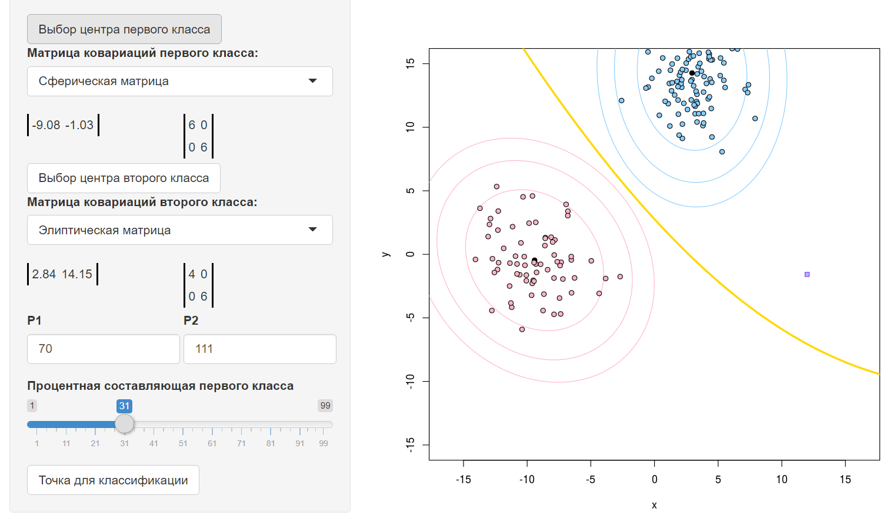

# Метод Plug-in

*Байесовский подход* является классическим в теории распознавания образов и лежит в основе многих методов. Он опирается на теорему о том, что если плотности распределения классов известны, то алгоритм классификации, имеющий минимальную вероятность ошибок, можно выписать в явном виде.

На практике плотности распределения классов, как правило, не известны. Их приходится оценивать (восстанавливать) по обучающей выборке. В результате байесовский алгоритм перестаёт быть оптимальным, так как восстановить плотность по выборке можно только с некоторой погрешностью. Чем короче выборка, тем выше шансы подогнать распределение под конкретные данные и столкнуться с эффектом переобучения.

Оценим параметры функций правдоподобия по частям обучающей выборки для каждого класса. Затем эти выборочные оценки подставим в оптимальный байесовский классификатор. Получим байесовский нормальный классификатор, который называется также подстановочным
(plug-in). На практике встречаются задачи, в которых признаки «почти линейно зависимы». Тогда матрица является плохо обусловленной, то есть близкой к некоторой вырожденной матрице. Это так называемая проблема мультиколлинеарности, которая влечет неустойчивость обратной матрицы. Она может непредсказуемо и сильно изменяться при незначительных вариациях исходных данных, например, связанных с погрешностями измерений. Неустойчивость снижает качество классификации.
$$
a(x) =\arg\max_{y\in Y} {\lambda}_{y}{P}_{y}{p}_{y}(x)
$$

### Программная реализация алгоритма

```R
getLevelLine <- function(mu,sigma) {  #получение коэффициентов линии уровня (x-mu)^T %*% Sig^-1 %*% (x-mu)
  invSigma <- solve(sigma)
  a <- invSigma[1,1]
  b <- invSigma[1,2]+invSigma[2,1]
  c <- invSigma[2,2]
  d <- -2*mu[1]*invSigma[1,1]-mu[2]*b
  e <- -2*mu[2]*invSigma[2,2]-mu[1]*b
  f <- invSigma[1,1]*mu[1]^2+invSigma[2,2]*mu[2]^2+mu[1]*mu[2]*b
  return (c(a,b,c,d,e,f))
}
  
  
plugIn <- function(mu1,sigma1,mu2,sigma2) {   #получение коэффициентов разделяющей линии плагин-алгоритма
  invSigma1 <- solve(sigma1)
  invSigma2 <- solve(sigma2)
  alpha <- invSigma1-invSigma2
  betta <- invSigma1%*%t(mu1)-invSigma2%*%t(mu2)
  a <- alpha[1,1]
  b <- alpha[1,2]+alpha[2,1]
  c <- alpha[2,2]
  d <- -2*betta[1,1]
  e <- -2*betta[2,1]
  f <- log(det(sigma1))-log(det(sigma2))+mu1%*%invSigma1%*%t(mu1)-mu2%*%invSigma2%*%t(mu2)
  return (c(a,b,c,d,e,f))
}
  
  
plugInAlgo <- function(mu1,sigma1,mu2,sigma2,x,y) {    #плагин-алгоритм
  params <- plugIn(mu1,sigma1,mu2,sigma2)
  z <- outer(x,y,function(x,y) {params[1]*x^2+params[2]*x*y+params[3]*y^2+params[4]*x+params[5]*y+params[6]})
  contour(x,y,z,levels=0,drawlabels=FALSE,lwd=3,col=colors[3],add=TRUE)
}
  
  
levelLine <- function(mu,sigma,x,y,levelColor) {    #построение линии уровня
  coeffs <- getLevelLine(mu,sigma)
  z <- outer(x,y,function(x,y) {coeffs[1]*x^2+coeffs[2]*x*y+coeffs[3]*y^2+coeffs[4]*x+coeffs[5]*y+coeffs[6]})
  contour(x,y,z,levels=c(5,10,15),drawlabels=FALSE,lwd=1,col=levelColor,add=TRUE)
  points(mu[1],mu[2],pch=19,bg=levelColor,asp=1)
}
```

### Результат работы алгоритма

Результатом работы алгоритма будет следующий график:

