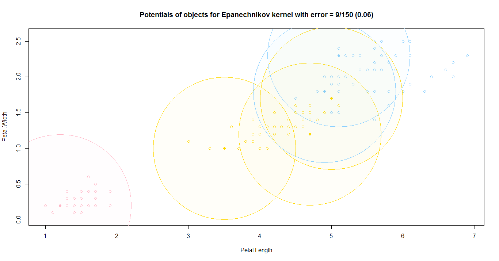
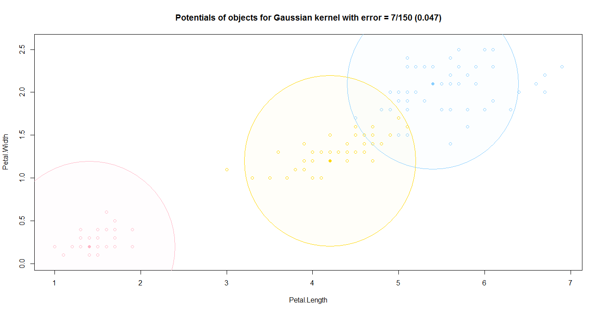
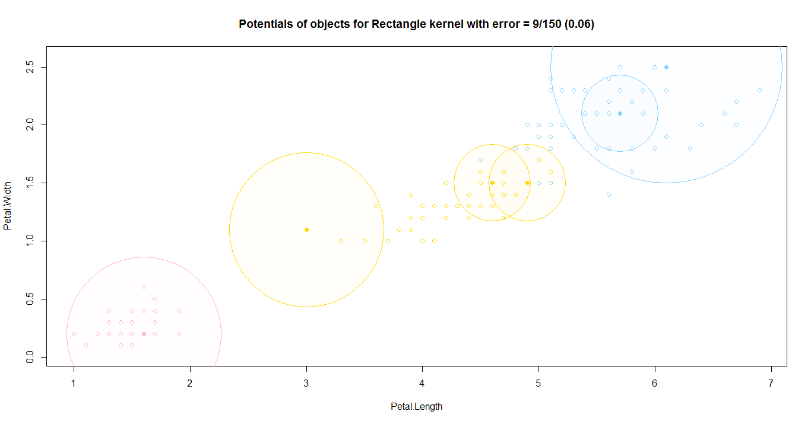
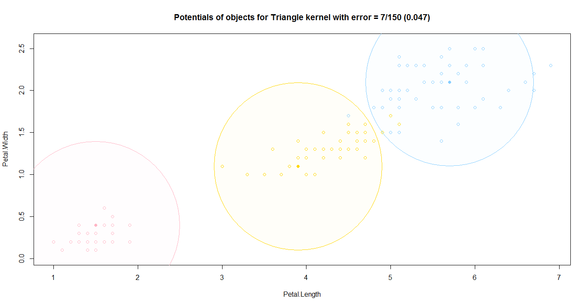
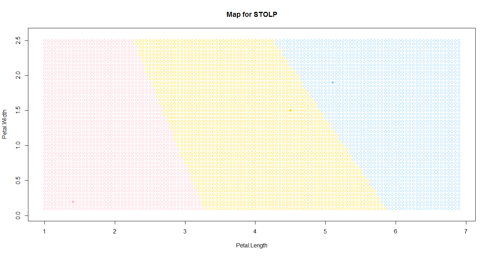
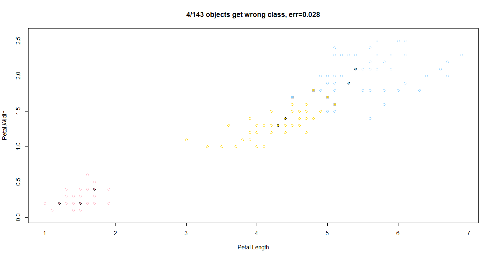

[К меню](https://github.com/Inc1ementia/ML1)

# Сравнение работы алгоритмов

| Название алгоритма                         | Параметры                                                    | Ошибка                      | Время работы |
| ------------------------------------------ | ------------------------------------------------------------ | --------------------------- | ------------ |
| Метод ближайшего соседа                    | k=1                                                          | 7/150 (0.047)               | 933.4        |
| Метод k-ближайших соседей                  | k=6                                                          | 5/150 (0.033)               | 770.86       |
| Модифицированный метод k-ближайших соседей | k=2                                                          | 6/150 (0.04)                | 781.67       |
| Метод k-взвешенных ближайших соседей       | k=6, q=1                                                     | 5/150 (0.033)               | 847.43       |
| Метод парзеновского окна (4 ядра)          | h=0.4, 1.1                                                   | 6/150 (0.04)                | 874.01       |
| Метод потенциальных функций                | Ширина окон определяется по ближайшему объекту чужого класса | 7/150 (0.047), 9/150 (0.06) | 875.21       |
| Метод STOLP                                | k=2, l0=5, delta=0                                                            | 4/147 (0.027)               | 61.59        |
| Метод FRiS-STOLP                           | lambda=0.9, theta=0.85                                                             | 4/143 (0.028)               | 104.39       |

|                                        |                                |
| ----------------------------------------------------- | --------------------------------------------- |
|                                  |                              |
|          |          |
|                |          |
|  |  |
|        |  |
|                                    |                              |

[К меню](https://github.com/Inc1ementia/ML1)
