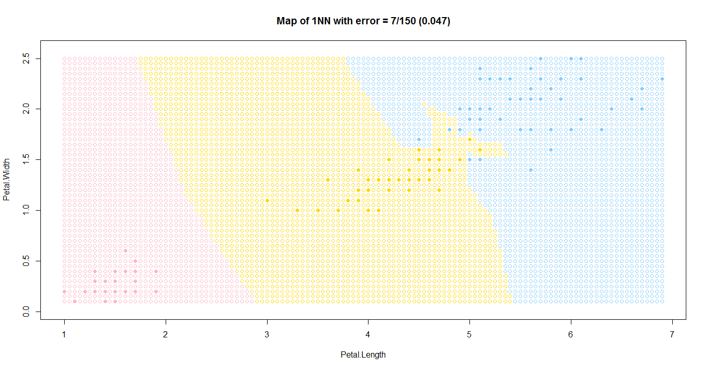
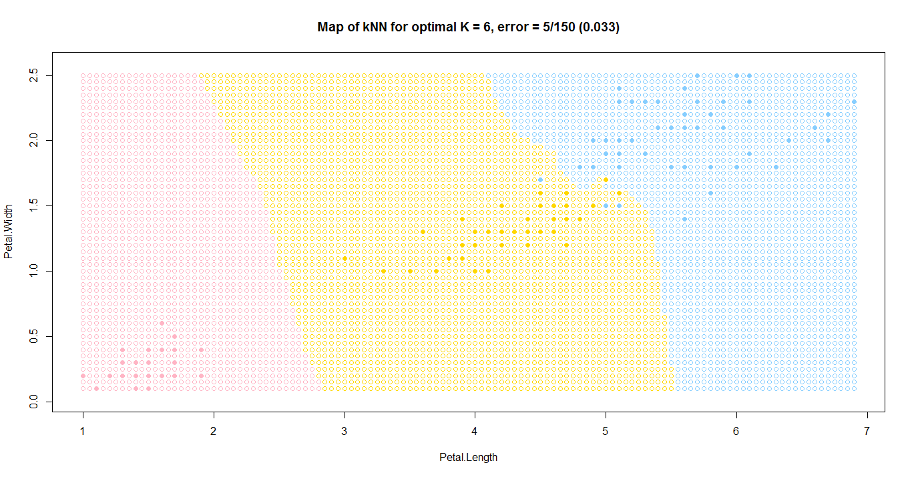
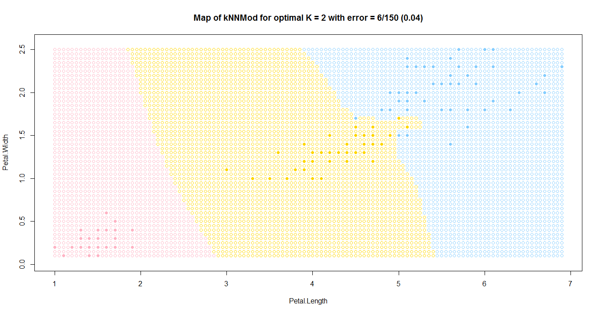
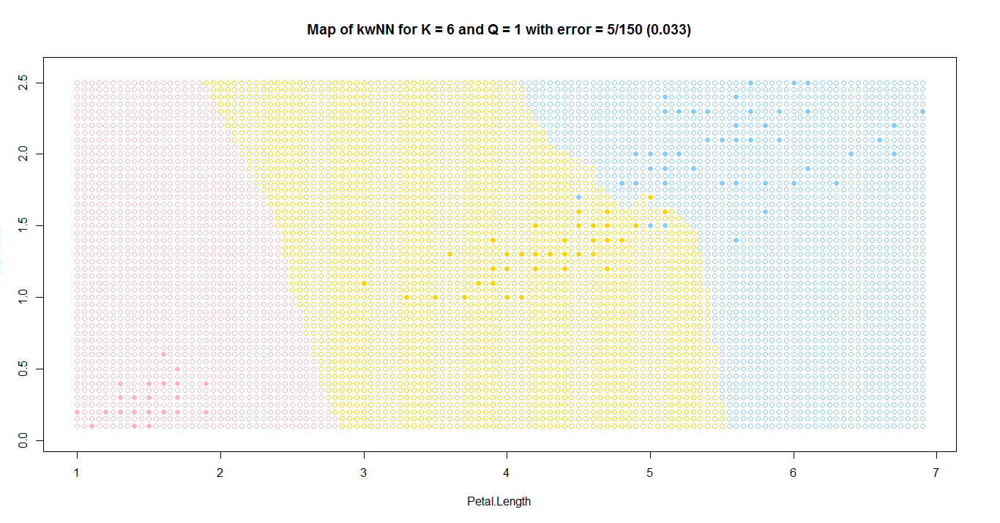
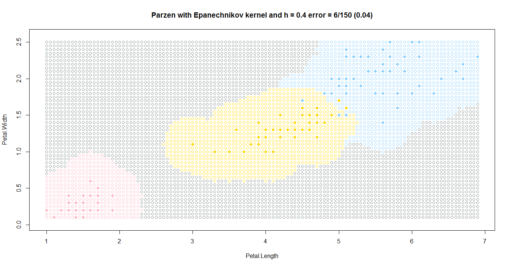
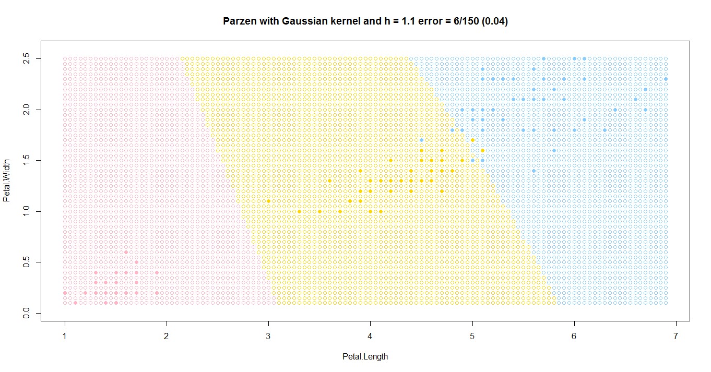
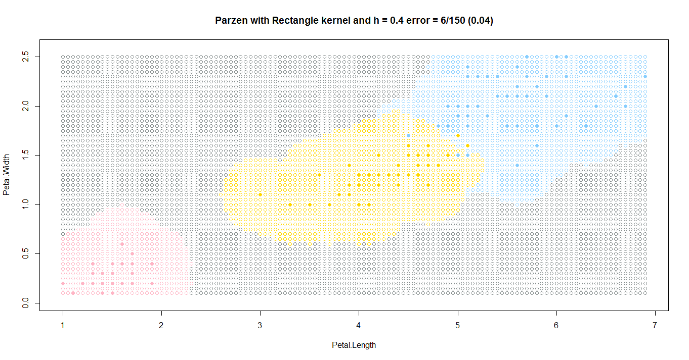
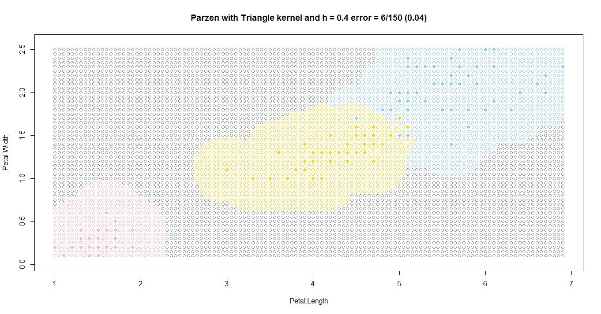

[К меню](https://github.com/Inc1ementia/ML1)

# Сравнение работы алгоритмов

| Название алгоритма                         | Параметры   | Ошибка        | Время работы |
| ------------------------------------------ | ----------- | ------------- | ------------ |
| Метод ближайшего соседа                    | k=1         | 7/150 (0.047) | 933.4        |
| Метод k-ближайших соседей                  | k=6         | 5/150 (0.033) | 770.86       |
| Модифицированный метод k-ближайших соседей | k=2         | 6/150 (0.04)  | 781.67       |
| Метод k-взвешенных ближайших соседей       | k=6, q=1    | 5/150 (0.033) | 847.43       |
| Метод парзеновского окна (4 ядра)          | h=0.4 (1.1) | 6/150 (0.04)  | 874.01       |

|                                |                        |
| --------------------------------------------- | ------------------------------------- |
|                          |                      |
|  |  |
|        |  |

[К меню](https://github.com/Inc1ementia/ML1)
