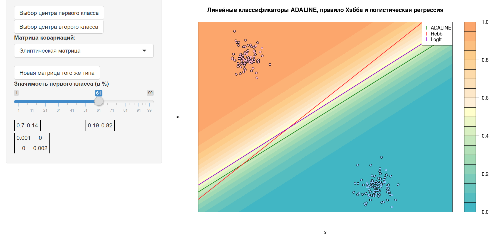
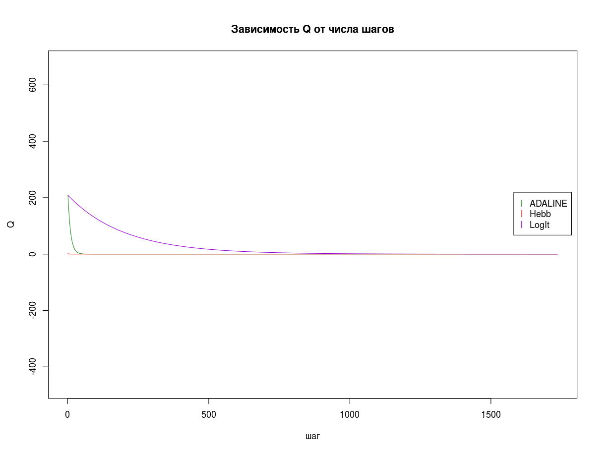

[К меню](https://github.com/Inc1ementia/ML1)

# Метод стохастического градиента

*Метод линейного классификатора* (linear classifier) — алгоритм классификации, основанный на построении линейной разделяющей поверхности. В случае двух классов разделяющей поверхностью является гиперплоскость, которая делит пространство признаков на два полупространства. В случае большего числа классов разделяющая поверхность кусочно-линейна.

Стохастический градиентный метод — один из основных подходов к реализации градиентного спуска для решения задачи минимизации эмпирического риска. Применяется для подбора вектора весов w в линейном классификаторе. Это пошаговый алгоритм, на каждой итерации которого вектор w изменяется в направлении наибольшего убывания функционала Q (то есть в направлении антиградиента):


Адаптивный линейный элемент(адаптивный линейный нейрон или ADALINE) - частный случай линейного классификатора или искусственной нейронной сети с одним слоем. Схема работы ADALINE несколько напоминает работу биологического нейрона. На вход подаётся вектор импульсов, состоящий из числовых признаков. Внутри нейрона импульсы складываются с некоторыми весами и, если суммарный импульс превысит порог активации, то нейрон возбуждается и выдаёт некоторое значение. Обучение ADALINE заключается в подборе "наилучших" значений вектора весов. Для этого используется дельта-правило, предложенное Видроу и Хоффом.


Экспериментально было установлено, что при синхронном возбуждении двух связанных нервных клеток синаптическая связь между ними усиливается. Чем чаще синапс угадывает правильный ответ, тем сильнее становится связь. Если же синапс начинает часто ошибаться или вообще перестаёт использоваться, связь ослабевает, информация начинается забываться. Таким образом, память реализуется в синапсах. В математической модели нейрона роль памяти играет вектор синаптических весов.

Цель обучения перцептрона состояла в том, чтобы при подаче на фотоэлементы закодированного образа на его выходе появлялась логическая единица в случае принадлежности поданного образа к заранее определенному классу и ноль в противном случае. Логика обучения следующая: если сигнал персептрона при некотором образе верен, то ничего корректировать не надо, если нет — производится корректировка весов сумматора.

Три вероятных случая классификации объединяются в правило Хэбба:


Логистическая регрессия — метод построения линейного классификатора, позволяющий оценивать апостериорные вероятности принадлежности объектов классам. Метод логистической регрессии основан на довольно сильных вероятностных предположениях, которые имеют несколько интересных последствий: линейный классификатор оказывается оптимальным байесовским; однозначно определяется функция потерь; можно вычислять не только принадлежность объектов классам, но также получать и численные оценки вероятности их принадлежности.

Логистическое правило обновления весов для градиентного шага в методе стохастического градиента:


Как правило, логистическая регрессия дает лучшие результаты по сравнению с линейным дискриминантом Фишера (поскольку она основана на менее жестких гипотезах), а также по сравнению с дельта-правилом и правилом Хэбба (поскольку она использует "более правильную" функцию потерь).

###  Алгоритм

1. На вход подаётся выборка, параметр сглаживания и тип алгоритма (ADALINE, правило Хэбба, логистическая регрессия)
2. Генерируется вектор весов и оценивается эмпирический риск
3. На каждом шаге выбирается один из объектов выборки, и для него делается шаг градиентного спуска
4. Процедура выполняется до тех пор, пока не будет сделано слишком много шагов или пока не стабилизируется значение эмпирического риска
5. На выходе - вектор весов

### Программная реализация алгоритма

```R 
adalineL <- function(w,x) {   #L для ADALINE
  n <- length(w)
  return ((c(w%*%x[1:n])*x[n+1]-1)^2)
}
  
  
adalineLL <- function(w,x) {   #L' для ADALINE
  n <- length(w)
  return (x[1:n]*(2.0*(c(w%*%x[1:n])*x[n+1]^2-x[n+1])))
}
  
  
hebbL <- function(w,x) {   #L для правила Хэбба
  n <- length(w)
  return (max(-c(w%*%x[1:n])*x[n+1],0))
}
  
  
hebbLL <- function(w,x) {   #L' для правила Хэбба
  n <- length(w)
  return (-x[1:n]*x[n+1])
}
  
  
logisticL <- function(w,x) {   #L для логистической регрессии
  n <- length(w)
  return (log2(1+exp(-c(w%*%x[1:n])*x[n+1])))
}
  
  
logisticLL <- function(w,x) {   #L' для логистической регрессии
  n <- length(w)
  return (x[1:n]*x[n+1]*(-1.0/(exp(c(w%*%x[1:n])*x[n+1])*log(2)+log(2))))
}
  
  
error <- function(w,objects,func) {   #функция подсчёта ошибки
  res <- 0
  l <- dim(objects)[1]
  for (i in 1:l) {
    res <- res+func(w,objects[i, ])
  }
  return (res)
}
  
  
findErrors <- function(w,objects,func) {   #функция поиска всех неправильно классифицируемых объектов для Хэбба
  res <- numeric()
  l <- dim(objects)[1]
  for (i in 1:l) {
    margin <- func(w,objects[i, ])
    if (margin>0 || c(w%*%objects[1:length(w)])==0)   #нулевое значение <w,x> или положительный отступ - ошибка
      res <- c(res,i)
  }
  return (res)
}
  
  
step <- function(w,obj,func) {   #градиентный шаг
  res <- func(w,obj)
  return (res)
}
  
  
gradient <- function(xl,lambda,funcL,funcLL,rule,weightInit=randomWeight) {
  l <- dim(xl)[1]
  n <- dim(xl)[2]-1
  w <- weightInit(n)   #инициализируем массив весов
  Q <- error(w,xl,funcL)    #считаем стартовое значение эмперического риска
  Qprev <- array(Q-100.0,10)   #массив для проверки нормализации эмпирического риска
  class <- sample(c(-1,1),1)    #один из случайных классов, для чередования
  steps <- 0
  QList <- Q
  while (TRUE) {
    steps <- steps+1
    if (rule=="H") {   #для правила Хэбба берём только плохие
      errored <- findErrors(w,xl,funcL)   #список плохих объектов
      if (length(errored)==0) break
      obj <- sample(errored,1)    #выбираем случайный
    } else {
      obj <- sample(which(xl[ ,n+1]==class,arr.ind=TRUE),1)   #выбираем случайный из предложенного класса
    }
    eps <- error(w,matrix(xl[obj, ],1,n+1),funcL)   #считаем ошибку на объекте
    if (rule=="L") {
      nu <- 1/sqrt(sum(xl[obj,1:n]*xl[obj,1:n]))
    } else {
      nu <- 1/steps
    }
    w <- w-nu*step(w,xl[obj, ],funcLL)   #и делаем градиентный спуск
    Q <- (1-lambda)*Q+lambda*eps    #пересчитываем значение эмперического риска
    QList <- c(QList,Q)
    class <- -class    #меняем класс на противоположный
    if (abs(mean(Qprev)-Q)<1e-3) {   #эмпирический риск стабилизировался
      break
    } else {
      Qprev <- c(Q,Qprev[1:9])
    }
    if (steps==2999) break    #слишком много шагов
  }
  return (c(w,QList))
}

##################

  mu1 <- matrix((values[["lastPoint"]])[ ,1],1,2)   #по последнему нажатию строятся матрицы центров классов
  mu2 <- matrix((values[["lastPoint"]])[ ,2],1,2)
  lambda1 <- input$domination
  lambda2 <- 100-lambda1
  w0 <- log(lambda1/lambda2)   #отношение l1/l2 для логистической регрессии
  if (!is.null(values[["xl"]])) {   #данные сохранены с прошлого раза
    xl <- values[["xl"]]
    xl1 <- xl[which(xl[ ,4]==-1), ]
    xl2 <- xl[which(xl[ ,4]==1), ]
    Q <- values[["Q"]]
    weights <- values[["weights"]]
  } else {    #генерируем новые данные
    xl1 <- mvrnorm(100,mu1,values[["sig"]])    #многомерное распределение точек классов
    xl2 <- mvrnorm(100,mu2,values[["sig"]])
    xl <- rbind(cbind(xl1,-1),cbind(xl2,1))   #объединяем два множества точек, указав классы
    xl <- cbind(xl[ ,1:2],-1,xl[ ,3])
    values[["xl"]] <- xl
    values[["weights"]] <- NULL
    values[["Q"]] <- NULL
  }
  mu1h <- muHat(xl1)
  mu2h <- muHat(xl2)
  sigh <- sigmaHat(xl1,xl2,mu1h,mu2h)
  x <- seq(0.0,1.0,by=0.01)
  y <- x
  if (is.null(values[["weights"]])) {   #нужно заново запустить градиентные спуски
    Q <- matrix(0.0,4,3000)
    weights <- matrix(0.0,3,3)
    Q[1, ] <- 1:3000
    result <- gradient(xl,0.1,adalineL,adalineLL,"A")
    weights[1, ] <- result[1:3]
    Q[2,1:(length(result)-3)] <- result[4:length(result)]
    result <- gradient(xl,0.1,hebbL,hebbLL,"H")
    weights[2, ] <- result[1:3]
    Q[3,1:(length(result)-3)] <- result[4:length(result)]
    result <- gradient(xl,0.005,logisticL,logisticLL,"L")
    weights[3, ] <- result[1:3]
    Q[4,1:(length(result)-3)] <- result[4:length(result)]
    values[["Q"]] <- Q
    values[["weights"]] <- weights
  }
  zz <- outer(x,y,function(x,y) {1/(1+exp(-(weights[3,1]*x+weights[3,2]*y-weights[3,3]-w0)))})
  coul <- c(coul1,rev(coul2))
  message <- "Линейные классификаторы ADALINE, правило Хэбба и логистическая регрессия"
  filled.contour(   #линии уровней для логистической регрессии
    x,y,zz,
    col=coul,
    main=message,
    xlab="x",ylab="y",
    plot.axes={
      points(xl[ ,1],xl[ ,2],pch=21,bg=colors[ifelse(xl[ ,4]==1,1,2)],col="black",asp=1)   #рисуем сами точки классов
      abline(weights[1,3]/weights[1,2],-weights[1,1]/weights[1,2],col=colors[3],lwd=2,asp=1)
      abline(weights[2,3]/weights[2,2],-weights[2,1]/weights[2,2],col=colors[4],lwd=2,asp=1)
      abline((weights[3,3]+w0)/weights[3,2],-weights[3,1]/weights[3,2],col=colors[5],lwd=2,asp=1)
      legend(0.88,1,c("ADALINE","Hebb","LogIt"),pch=c("l","l","l"),col=colors[3:5])
    }
  )
```

### Результат работы алгоритма с использованием [shiny](https://inc1ementia.shinyapps.io/gradientShiny/)

Результатом работы алгоритма будут следующие графики:





[К меню](https://github.com/Inc1ementia/ML1)
