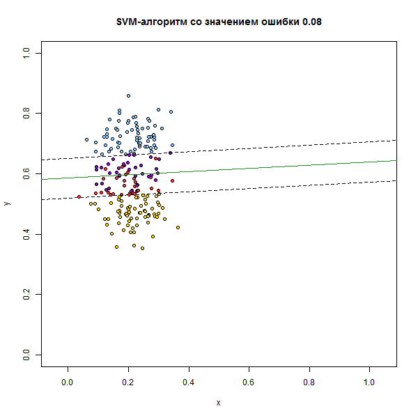
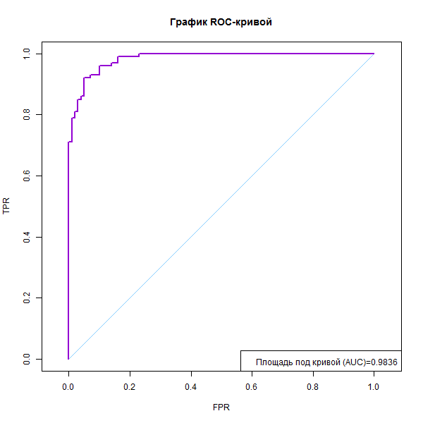
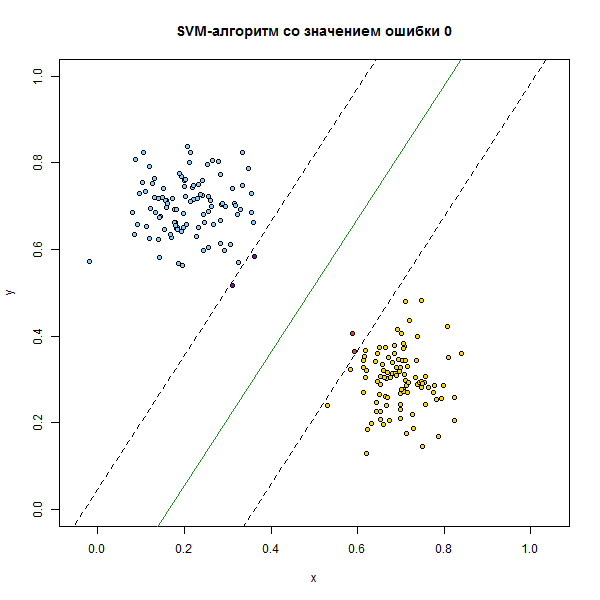
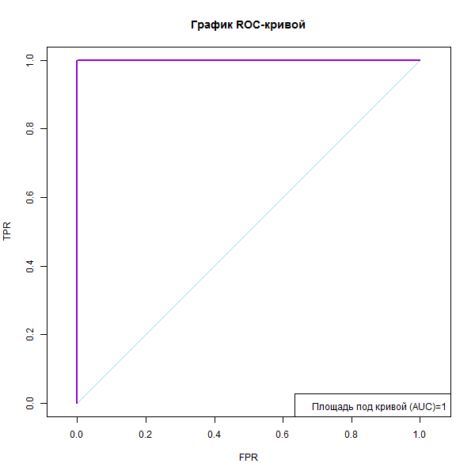
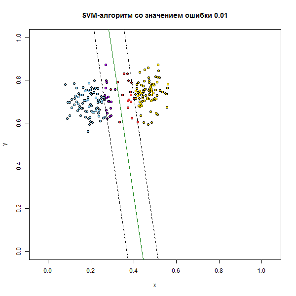
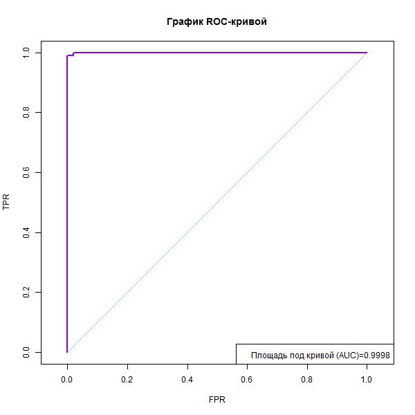

# Метод опорных векторов

*Метод линейного классификатора* (linear classifier) — алгоритм классификации, основанный на построении линейной разделяющей поверхности. В случае двух классов разделяющей поверхностью является гиперплоскость, которая делит пространство признаков на два полупространства. В случае большего числа классов разделяющая поверхность кусочно-линейна.

Метод опорных векторов — один из наиболее популярных методов обучения, который применяется для решения задач классификации и регрессии. Основная идея метода заключается в построении оптимальной разделяющей гиперплоскости, делящей объекты выборки оптимальным способом.

Метод SVM обладает несколькими замечательными свойствами. Во-первых, обучение SVM сводится к задаче квадратичного программирования, имеющей единственное решение, которое вычисляется достаточно эффективно даже на выборках в сотни тысяч объектов. Во-вторых, решение обладает свойством разреженности: положение оптимальной разделяющей гиперплоскости зависит лишь от небольшой доли обучающих объектов. 

Для линейно разделимой выборки:
$$
\begin{cases}
\langle w,w\rangle \rightarrow \min ;\\
{y}_{i}(\langle w,{x}_{i}\rangle -{w}_{0})\geq 1,\quad i=1,\dots,l.
\end{cases}
$$
Для линейно неразделимой выборки:
$$
\begin{cases}
\frac{1}{2}\langle w,w\rangle +C\sum_{i=1}^{l} {\xi}_{i}\rightarrow \min\limits_{w,{w}_{0},\xi};\\
{y}_{i}(\langle w,{x}_{i}\rangle -{w}_{0})\geq 1-{\xi}_{i},\quad i=1,\dots,l;\\
{\xi}_{i}\geq 0,\quad i=1,\dots,l.
\end{cases}
$$
ROC-кривая показывает, что происходит с числом ошибок обоих типов, если изменяется отношение потерь. Каждая точка на ROC-кривой соответствует некоторому алгоритму. В общем случае это даже не обязательно кривая — дискретное множество алгоритмов может быть отображено в тех же координатах в виде точечного графика. Чем выше проходит ROC-кривая, тем выше качество классификации. Идеальная ROC-кривая проходит через левый верхний угол — точку (0, 1). Наихудший алгоритм соответствует диагональной прямой, соединяющей точки (0, 0) и (1, 1); её также изображают на графике как ориентир.

Для построения ROC-кривой нет необходимости вычислять FPR и TPR суммированием по всей выборке при каждом параметре. Более эффективный алгоритм основан на простой идее, что в качестве значений порога достаточно перебрать только значения дискриминантной функции
$$
f({x}_{i})=\langle w, {x}_{i} \rangle
$$
В роли общей характеристики качества классификации, не зависящей от конъюнктурного параметра, выступает площадь под ROC-кривой, AUC. 

###  Алгоритм

1. С помощью метода svm из библиотеки kernlib вычислить вектор w
2. По значению w построить разделяющую прямую и отступ.
3. Объекты, чьё скалярное произведение <w,x> меньше 0, будет отнесено к классу "-1", остальные - к "+1".

### Программная реализация алгоритма

```R
muHat <- function(xl) {   #считаем значение мю по данным для класса
  n <- dim(xl)[2]
  mu <- array(NA,n)
  for (i in 1:n) {
    mu[i] <- mean(xl[ ,i])   #по каждой координате берём среднее
  }
  return (t(mu))
}
  
  
sigmaHat <- function(xl1,xl2,mu1,mu2) {   #считаем зачение сигма по данным для класса и полученному мю
  l <- dim(xl1)[1]
  ll <- dim(xl2)[1]
  n <- dim(xl1)[2]
  sigma <- matrix(0,n,n)
  for (i in 1:l) {
    sigma <- sigma+(t(xl1[i, ]-mu1) %*% (xl1[i, ]-mu1))/(l-1)
  }
  for (i in 1:ll) {
    sigma <- sigma+(t(xl2[i, ]-mu2) %*% (xl2[i, ]-mu2))/(ll-1)
  }
  return (sigma)
}
  
  
randomizeCovMatrix <- function(val) {
  if (val==1) {   #сферическая матрица
    d <- sample(1:10,1)
    values[["sig"]] <- matrix(c(d*0.001,0,0,d*0.001),2,2)
  } else if (val==2) {   #эллиптическая
    d <- sample(1:10,2)
    values[["sig"]] <- matrix(c(d[1]*0.001,0,0,d[2]*0.001),2,2)
  } else {   #наклонный эллипс
    d <- sample(1:10,2)
    int <- floor(sqrt(d[1]*d[2])-0.001)
    e <- sample(1:int,1)
    e <- ifelse(sample(1:2,1)==1,1,-1)*e
    values[["sig"]] <- matrix(c(d[1]*0.001,e*0.001,e*0.001,d[2]*0.001),2,2)
  }
}
  
  
quality <- function(w,xl) {  #функция качества
  Q <- 0
  l <- dim(xl)[1]
  n <- dim(xl)[2]-1
  for (i in 1:l) {
    sc <- corr(w,c(xl[i,1:n],-1))
    if (sc*xl[i,n+1]<=0) {
      Q <- Q+1
    }
  }
  return (Q)
}
  
  
corr <- function(w,x) {  #скалярное произведение <w,xi>
  return (sum(w*x))
}
  
  
buildROC <- function(w,xl) {   #построение ROC-кривой
  n <- dim(xl)[2]-1
  l <- dim(xl)[1]
  lMinus <- length(which(xl[ ,n+1]==-1,arr.ind=TRUE))   #число объектов класса -1
  lPlus <- l-lMinus   #число объектов класса +1
  corrVal <- matrix(NA,l,2)
  for (i in 1:l) {
    corrVal[i, ] <- c(i,corr(w,c(xl[i,1:n],-1)))
  }
  ordered <- xl[order(corrVal[ ,2],decreasing=TRUE),n+1]   #сортируем выборку по убыванию расстояния до прямой
  ROCPnt <- matrix(0,l+1,2)
  FPR <- 0
  TPR <- 0
  AUC <- 0
  for (i in 1:l) {
    yi <- ordered[i]
    if (yi==-1) {
      FPR <- FPR+(1.0/lMinus)
      AUC <- AUC+(1.0/lMinus)*TPR
    } else {
      TPR <- TPR+(1.0/lPlus)
    }
    ROCPnt[(i+1), ] <- c(FPR,TPR)
  }
  values[["ROC"]] <- ROCPnt   #запоминаем параметр ROC-кривой и AUC
  values[["AUC"]] <- AUC
}
```

### Результат работы алгоритма с использованием [shiny](https://inc1ementia.shinyapps.io/SVMShiny/)

Результатом работы алгоритма будут следующие графики:













