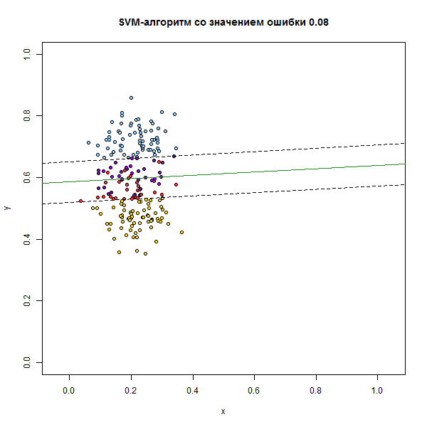
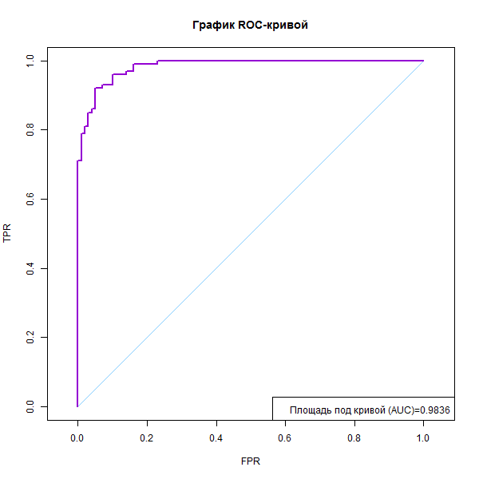
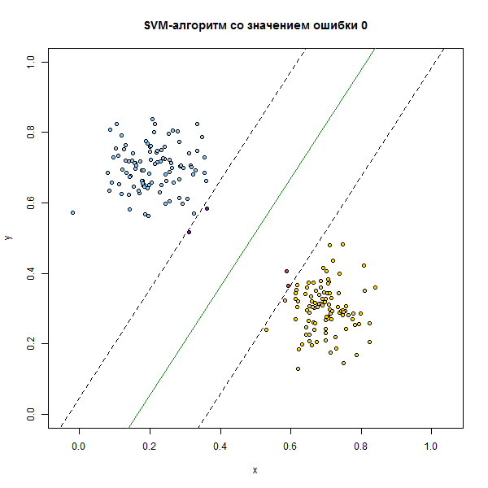
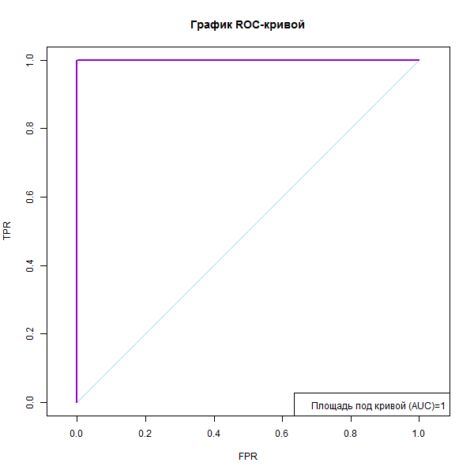
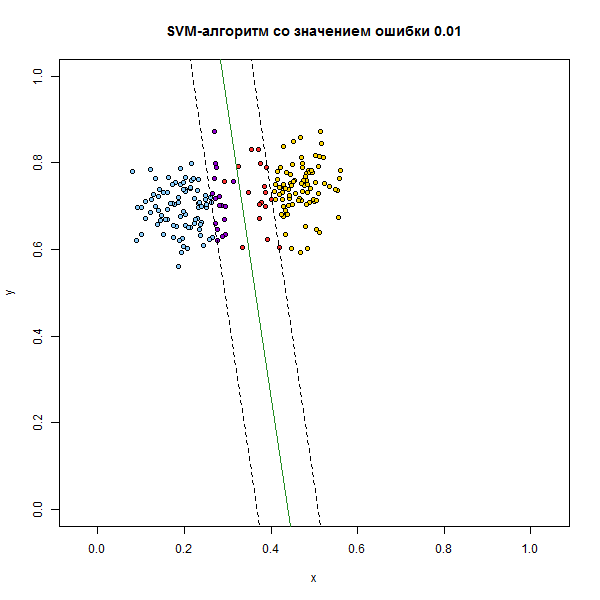
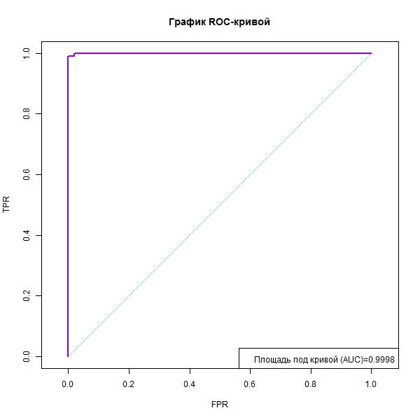

[К меню](https://github.com/Inc1ementia/ML1)

# Метод опорных векторов

*Метод линейного классификатора* (linear classifier) — алгоритм классификации, основанный на построении линейной разделяющей поверхности. В случае двух классов разделяющей поверхностью является гиперплоскость, которая делит пространство признаков на два полупространства. В случае большего числа классов разделяющая поверхность кусочно-линейна.

Метод опорных векторов — один из наиболее популярных методов обучения, который применяется для решения задач классификации и регрессии. Основная идея метода заключается в построении оптимальной разделяющей гиперплоскости, делящей объекты выборки оптимальным способом.

Метод SVM обладает несколькими замечательными свойствами. Во-первых, обучение SVM сводится к задаче квадратичного программирования, имеющей единственное решение, которое вычисляется достаточно эффективно даже на выборках в сотни тысяч объектов. Во-вторых, решение обладает свойством разреженности: положение оптимальной разделяющей гиперплоскости зависит лишь от небольшой доли обучающих объектов. 

Для линейно разделимой выборки:


Для линейно неразделимой выборки:


ROC-кривая показывает, что происходит с числом ошибок обоих типов, если изменяется отношение потерь. Каждая точка на ROC-кривой соответствует некоторому алгоритму. В общем случае это даже не обязательно кривая — дискретное множество алгоритмов может быть отображено в тех же координатах в виде точечного графика. Чем выше проходит ROC-кривая, тем выше качество классификации. Идеальная ROC-кривая проходит через левый верхний угол — точку (0, 1). Наихудший алгоритм соответствует диагональной прямой, соединяющей точки (0, 0) и (1, 1); её также изображают на графике как ориентир.

Для построения ROC-кривой нет необходимости вычислять FPR и TPR суммированием по всей выборке при каждом параметре. Более эффективный алгоритм основан на простой идее, что в качестве значений порога достаточно перебрать только значения дискриминантной функции


В роли общей характеристики качества классификации, не зависящей от конъюнктурного параметра, выступает площадь под ROC-кривой, AUC. 

###  Алгоритм

1. С помощью метода svm из библиотеки kernlib вычислить вектор w
2. По значению w построить разделяющую прямую и отступ.
3. Объекты, чьё скалярное произведение <w,x> меньше 0, будет отнесено к классу "-1", остальные - к "+1".

### Программная реализация алгоритма

```R
quality <- function(w,xl) {  #функция качества
  Q <- 0
  l <- dim(xl)[1]
  n <- dim(xl)[2]-1
  for (i in 1:l) {
    sc <- corr(w,c(xl[i,1:n],-1))
    if (sc*xl[i,n+1]<=0) {
      Q <- Q+1
    }
  }
  return (Q)
}
  
  
corr <- function(w,x) {  #скалярное произведение <w,xi>
  return (sum(w*x))
}
  
  
buildROC <- function(w,xl) {   #построение ROC-кривой
  n <- dim(xl)[2]-1
  l <- dim(xl)[1]
  lMinus <- length(which(xl[ ,n+1]==-1,arr.ind=TRUE))   #число объектов класса -1
  lPlus <- l-lMinus   #число объектов класса +1
  corrVal <- matrix(NA,l,2)
  for (i in 1:l) {
    corrVal[i, ] <- c(i,corr(w,c(xl[i,1:n],-1)))
  }
  ordered <- xl[order(corrVal[ ,2],decreasing=TRUE),n+1]   #сортируем выборку по убыванию расстояния до прямой
  ROCPnt <- matrix(0,l+1,2)
  FPR <- 0
  TPR <- 0
  AUC <- 0
  for (i in 1:l) {
    yi <- ordered[i]
    if (yi==-1) {
      FPR <- FPR+(1.0/lMinus)
      AUC <- AUC+(1.0/lMinus)*TPR
    } else {
      TPR <- TPR+(1.0/lPlus)
    }
    ROCPnt[(i+1), ] <- c(FPR,TPR)
  }
  values[["ROC"]] <- ROCPnt   #запоминаем параметр ROC-кривой и AUC
  values[["AUC"]] <- AUC
}

##################

  mu1 <- matrix((values[["lastPoint"]])[ ,1],1,2)   #по последнему нажатию строятся матрицы центров классов
  mu2 <- matrix((values[["lastPoint"]])[ ,2],1,2)
  C <- input$Ccoeff
  if (!is.null(values[["xl"]])) {   #данные сохранены с прошлого раза
    xl <- values[["xl"]]
    xl1 <- xl[which(xl[ ,3]==-1), ]
    xl2 <- xl[which(xl[ ,3]==1), ]
  } else {    #генерируем новые данные
    xl1 <- mvrnorm(100,mu1,values[["sig"]])    #многомерное распределение точек классов
    xl2 <- mvrnorm(100,mu2,values[["sig"]])
    xl <- rbind(cbind(xl1,-1),cbind(xl2,1))   #объединяем два множества точек, указав классы
    values[["xl"]] <- xl
  }
  mu1h <- muHat(xl1)
  mu2h <- muHat(xl2)
  sigh <- sigmaHat(xl1,xl2,mu1h,mu2h)
  x <- seq(0.0,1.0,by=0.01)
  y <- x
  svp <- ksvm(x=xl[ ,1:2],y=xl[ ,3],type="C-svc",kernel="vanilladot",C=C,scaled=c())  #вызов SVM
  bad <- SVindex(svp)   #индексы точек, ставших опорными
  w <- colSums(coef(svp)[[1]]*xl[bad,1:2])  #веса
  w0 <- b(svp)   #и добавочный коэффициент
  w[3] <- w0
  message <- paste0("SVM-алгоритм со значением ошибки ",round(quality(w,xl)/dim(xl)[1],7))
  plot(x,y,main=message,col="white",asp=1)
  points(xl[-bad,1],xl[-bad,2],pch=21,bg=colors[ifelse(xl[-bad,3]==-1,1,2)],asp=1)
  points(xl[bad,1],xl[bad,2],pch=21,bg=colors[ifelse(xl[bad,3]==-1,4,5)],asp=1)
  abline(w0/w[2],-w[1]/w[2],col=colors[3],lwd=1,asp=1)
  abline((w0+1)/w[2],-w[1]/w[2],lty=2,asp=1)
  abline((w0-1)/w[2],-w[1]/w[2],lty=2,asp=1)
  w <- w/w[2]
  l <- dim(xl)[1]
  n <- dim(xl)[2]-1
  d <- 0
  ind <- 1
  for (i in 1:l) {   #находим самую дальнюю от прямой точку
    di <- abs(corr(w,c(xl[i,1:n],-1)))
    if (di>d) {
      d <- di
      ind <- i
    }
  }
  d <- ifelse(corr(w,c(xl[ind,1:n],-1))<0,-1,1)
  if (d!=xl[ind,n+1]) w <- w*-1   #и если она неправильно классифицируется, то меняем знак прямой
  buildROC(w,xl)   #построение ROC-кривой
```

### Результат работы алгоритма с использованием [shiny](https://inc1ementia.shinyapps.io/SVMShiny/)

Результатом работы алгоритма будут следующие графики:













[К меню](https://github.com/Inc1ementia/ML1)
