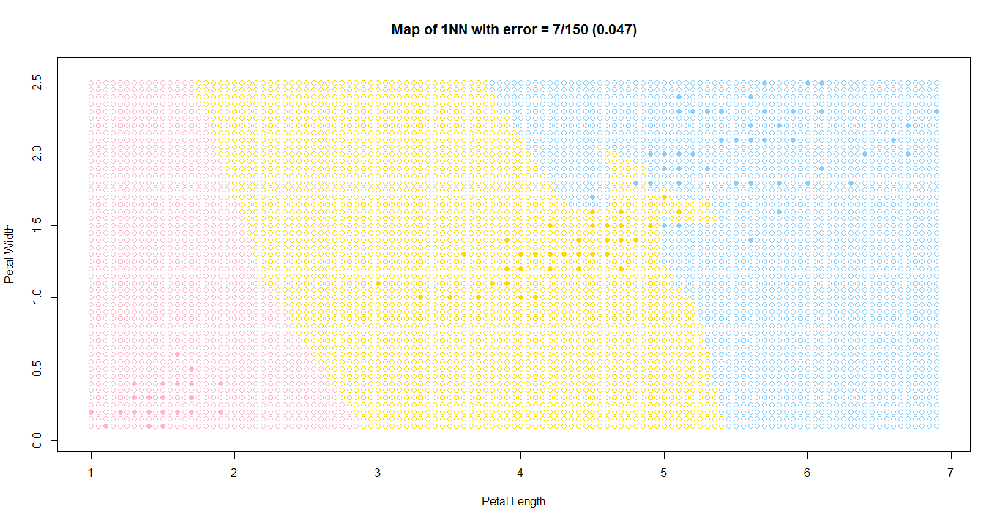

[К меню](https://github.com/Inc1ementia/ML1)

# Метод 1NN или Метод ближайшего соседа

### Суть метода

*Метрические методы обучения* — методы, основанные на анализе сходства объектов. (similarity-based learning, distance-based learning). Для формализации понятия сходства вводится *функция расстояния* в пространстве объектов X.

Метрические алгоритмы относятся к методам ленивого обучения (lazy learning), а также к методам рассуждения по прецедентам (case-based reasoning, CBR).

Метод 1NN или Метод ближайшего соседа находит ближайшего (т.е. с наименьшим значением функции расстояния) соседа в пространстве признаков и присваивает точку *x* к классу этого соседа, т.е. 


### Алгоритм

1. Вычислить расстояние до каждого объекта обучающей выборки
2. Объекты обучающей выборки отсортировать по расстоянию до рассматриваемой точки
3. Найти объект с минимальным расстоянием
4. Присвоить рассматриваемой точке класс этого объекта

### Программная реализация алгоритма

```R
eucDist <- function(u,v) {  #функция расстояния между парой точек
  return (sqrt(sum((u-v)^2)))
}


sortObjbyDist <- function(xl,z,metricFunc=eucDist) {  #функция сортировки массива по расстоянию до z
  l <- dim(xl)[1]
  n <- dim(xl)[2]-1
  dist <- matrix(NA,l,2)
  for (i in 1:l) {
    dist[i, ] <- c(i, metricFunc(xl[i,1:n],z))  #создание списка пар (номер объекта, расстояние до z)
  }
  orderedXl <- xl[order(dist[ ,2]), ]   #сортировка списка объектов
  return (orderedXl)
}


kNN <- function(xl,z) {   #функция выбора класса методом 1NN
  orderedXl <- sortObjbyDist(xl,z)
  n <- dim(orderedXl)[2]-1
  counts <- table(orderedXl[1,n+1])
  class <- names(which.max(counts))   #выбирает класс ближайшего объекта
  return (class)
}
```

### Результат работы алгоритма

Результатом работы алгоритма будет следующий график

 

[К меню](https://github.com/Inc1ementia/ML1)
