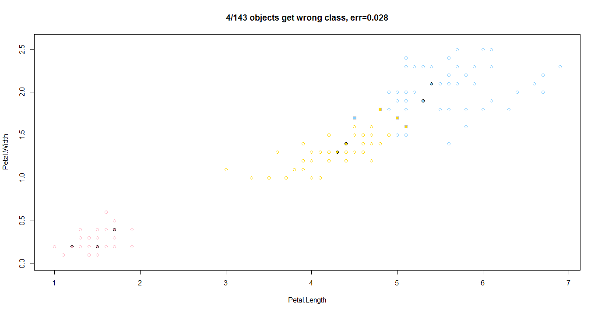
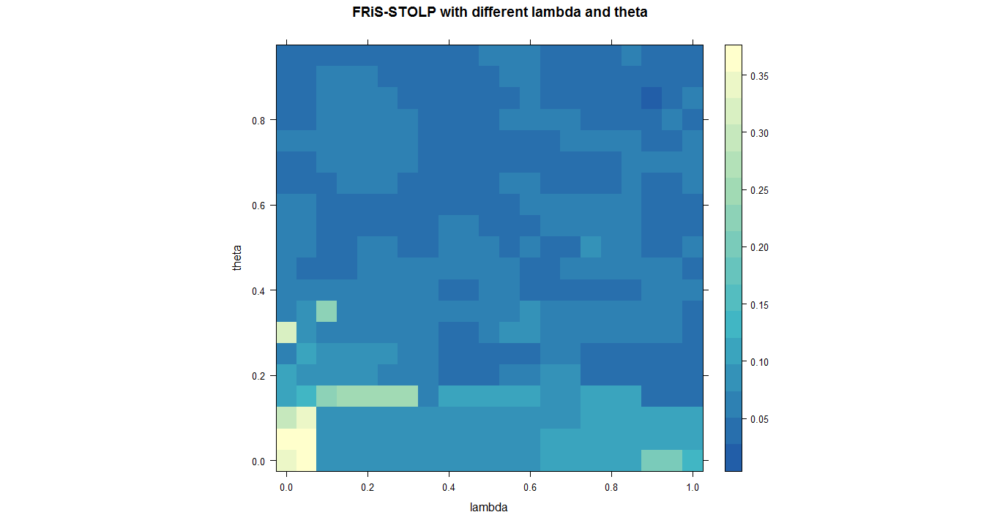

# Метод FRiS-STOLP

*Метрические методы обучения* (similarity-based learning, distance-based learning) — методы, основанные на анализе сходства объектов. Для формализации понятия сходства вводится *функция расстояния* в пространстве объектов X.

Метрические алгоритмы относятся к методам ленивого обучения (lazy learning), а также к методам рассуждения по прецедентам (case-based reasoning, CBR).

Отступом (margin) объекта относительно алгоритма классификации, имеющего вид
$$
a(u) =\arg\min_{y\in Y} {W}_{y}(u,{X}^{l})
$$

называется величина
$$
M({x}_{i}) ={W}_{{y}_{i}}({x}_{i},{X}^{l}) - \max_{y\in Y\backslash\{{y}_{i}\}} {W}_{y}( {x}_{i},{X}^{l})
$$
Отступ показывает степень типичности объекта. Отступ отрицателен тогда и только тогда, когда алгоритм допускает ошибку на данном объекте. зависимости от значений отступа обучающие объекты условно делятся на пять типов, в порядке убывания отступа: эталонные, неинформативные, пограничные, ошибочные, шумовые. 

Эталонные объекты имеют большой положительный отступ, плотно окружены объектами своего класса и являются наиболее типичными его представителями.

Неинформативные объекты также имеют положительный отступ. Изъятие этих объектов из выборки (при условии, что эталонные объекты остаются), не влияет на качество классификации. Фактически, они не добавляют к эталонам никакой новой информации. 

Шумовые объекты или выбросы — это небольшое число объектов с большими отрицательными отступами. Они плотно окружены объектами чужих классов и классифицируются неверно.

Функция конкурентного сходства или FRiS-функция — мера сходства двух объектов, исчисляемая относительно некоторого иного объекта. В отличие от других существующих мер сходства FRiS-функция позволяет не просто отвечать на вопросы вида "далеко-близко?", "похож-не похож?", но также давать количественную оценку ответа на вопрос "по сравнению с чем?". Такой подход позволяет учитывать большее число факторов при классификации.

Алгоритм FRiS-STOLP создаёт в процессе работы сокращенное описание обучающей выборки. Это позволяет сократить расход памяти, избавиться от ошибок и выбросов, содержащихся в ней, но при этом сохранить информацию, необходимую для дальнейшего распознавания новых объектов.

### Алгоритм

1. Инициализировать начальные множества эталонов

2. Инициализировать искомые множества эталонов

3. Пока множество рассматриваемых объектов непусто:

   Сформировать множество правильно классифицированных объектов

   Удалить правильно классифицированные объекты из дальнейшего рассмотрения (из множеств эталонов и из обучающей выборки)

   Добавить новый эталон для каждого класса

4. Вернуть искомые множества эталонов для каждого класса

### Программная реализация алгоритма

```R
weight <- function(u,x,z) {   #функция S(u,x|x')
  return ((distMap[u,z]-distMap[u,x])/(distMap[u,z]+distMap[u,x]))
}


findEtalon <- function(xl,yClass,omega,lambda,subArray) {   #для указанного класса ищет эталон
  l <- dim(xl)[1]
  n <- dim(xl)[2]
  xly <- which(xl[subArray,n]==yClass,arr.ind=TRUE)   #выделяем X_y
  xly <- subArray[xly]
  ly <- length(xly)
  if (ly<=1) return (NA)   #если элементов слишком мало, то ничего не делаем
  neighbor <- array(NA,l)
  for (i in subArray) {
    neighbor[i] <- NN(omega,i)   #находим ближайшего соседа для каждого объекта из X_y
  }
  effective <- array(0,ly)
  for (x in 1:ly) {
    defence <- 1.0/(ly-1)
    tolerance <- 1.0/(length(subArray)-ly)
    sum <- 0.0
    for (u in 1:ly) {
      if (u!=x && is.na(neighbor[xly[u]])==FALSE) {
        sum <- sum+weight(xly[u],xly[x],neighbor[xly[u]])   #считаем "защищённость"
      }
    }
    defence <- defence*sum
    sum <- 0.0
    for (v in subArray) {
      if (v!=xly[x] && is.na(neighbor[v])==FALSE) {
        sum <- sum+weight(v,xly[x],neighbor[v])   #считаем "толерантность"
      }
    }
    tolerance <- tolerance*sum
    effective[x] <- lambda*defence + (1-lambda)*tolerance   #эффективность текущего объекта
  }
  return (xly[which.max(effective)])   #выбираем лучший объект
}


FRiSSTOLP <- function(xl,lambda,theta) {   #FRis-STOLP для выбранных lambda и theta
  classes <- names(colors)
  clCount <- length(classes)
  l <- dim(xl)[1]
  n <- dim(xl)[2]
  omegaCoor <- matrix(0,clCount,4)   #указатели на индексы в массиве omega:
  #первые два столбца - текущий набор эталонов по классам, 3-4 - новые наборы, которые потом заменят текущие
  omega <- numeric()   #массив эталонов, содержит эталоны каждого из классов
  pos <- 1
  items <- c(1:l)
  for (i in 1:clCount) {
    other <- which(xl[ ,n]!=classes[i],arr.ind=TRUE)   #все объекты чужих классов
    etalon <- findEtalon(xl,classes[i],other,lambda,items)   #определяем эталон в своём классе
    omegaCoor[i,3] <- pos
    omegaCoor[i,4] <- pos
    pos <- pos+1
    omega <- c(omega,etalon)
  }
  for (i in 1:clCount) {   #заменяем индексы текущих эталонов на новые
    omegaCoor[i,1:2] <- omegaCoor[i,3:4]
  }
  omega <- omega[omegaCoor[1,1]:omegaCoor[clCount,2]]   #заменяем текущие эталоны на новые
  val <- omegaCoor[1,1]-1   #сдвигаем координаты, чтобы индексы были верными
  for (i in 1:clCount) {
    omegaCoor[i,1] <- omegaCoor[i,1]-val
    omegaCoor[i,2] <- omegaCoor[i,2]-val
  }
  pos <- length(omega)+1   #индекс следующей свободной ячейки в массиве эталонов
  for (i in 1:clCount) {
    part <- numeric()
    for (j in 1:clCount) {
      if (i!=j) {    #берём эталоны из чужих классов
        part <- c(part,omega[omegaCoor[j,1]:omegaCoor[j,2]])
      }
    }
    etalon <- findEtalon(xl,classes[i],part,lambda,items)   #пересчитываем эталон текущего класса
    omegaCoor[i,3] <- pos
    omegaCoor[i,4] <- pos
    pos <- pos+1
    omega <- c(omega,etalon)
  }
  for (i in 1:clCount) {   #заменяем индексы текущих эталонов на новые
    omegaCoor[i,1:2] <- omegaCoor[i,3:4]
  }
  omega <- omega[omegaCoor[1,1]:omegaCoor[clCount,2]]   #заменяем текущие эталоны на новые
  val <- omegaCoor[1,1]-1   #сдвигаем координаты, чтобы индексы были верными
  for (i in 1:clCount) {
    omegaCoor[i,1] <- omegaCoor[i,1]-val
    omegaCoor[i,2] <- omegaCoor[i,2]-val
  }
  pos <- length(omega)   #индекс текущей последней ячейки в массиве эталонов
  while (length(items)>0) {   #цикл добавления эталонов
    u <- numeric()
    for (i in items) {
      class <- which(classes==xl[i,n],arr.ind=TRUE)   #узнаём класс объекта
      friend <- NN(omega[omegaCoor[class,1]:omegaCoor[class,2]],i)   #находим ближайший свой эталон
      friend <- omega[omegaCoor[class,1]+friend-1]
      part <- numeric()
      for (j in 1:clCount) {
        if (j!=class) {
          part <- c(part,omega[omegaCoor[j,1]:omegaCoor[j,2]])   #список чужих эталонов
        }
      }
      enemy <- NN(part,i)   #находим ближайшего чужого
      enemy <- part[enemy]
      w <- weight(i,friend,enemy)   #считаем функцию S
      if (w>theta) {   #если она больше theta, то объект классифицирован достаточно правильно
        u <- c(u,i)
      }
    }
    if (length(u)>0) {   #если есть новые хорошие объекты
      for (i in 1:length(u)) {
        items <- items[which(items!=u[i],arr.ind=TRUE)]   #то их надо исключить из дальнейшего рассмотрения
      }
    } else {
      break   #дальше начнётся стогнация, можно сразу заканчивать цикл
    }
    for (i in 1:pos) {
      val <- which(u==omega[i],arr.ind=TRUE)   #если среди эталонов есть тот, кого можно классифицировать
      if (length(val)>0) {
        omega[i] <- NA   #то удаляем его из списка эталонов
      }
    }
    pos2 <- pos+1
    for (i in 1:clCount) {   #для каждого класса сдвигаем массив эталонов с учётом исключённых объектов
      etalon <- which(is.na(omega[omegaCoor[i,1]:omegaCoor[i,2]])==FALSE,arr.ind=TRUE)
      omegaCoor[i,3] <- pos2
      pos2 <- pos2+length(etalon)
      if (pos2==omegaCoor[i,3]) {
        omegaCoor[i,3] <- NA
        omegaCoor[i,4] <- NA
      } else {
        omegaCoor[i,4] <- pos2-1
      }
      omega <- c(omega,omega[omegaCoor[i,1]-1+etalon])
    }
    for (i in 1:clCount) {   #заменяем индексы текущих эталонов на новые
      omegaCoor[i,1:2] <- omegaCoor[i,3:4]
    }
    omega <- omega[omegaCoor[1,1]:omegaCoor[clCount,2]]   #заменяем текущие эталоны на новые
    val <- omegaCoor[1,1]-1   #сдвигаем координаты, чтобы индексы были верными
    for (i in 1:clCount) {
      omegaCoor[i,1] <- omegaCoor[i,1]-val
      omegaCoor[i,2] <- omegaCoor[i,2]-val
    }
    pos <- length(omega)+1   #индекс следующей свободной ячейки в массиве эталонов
    for (i in 1:clCount) {
      part <- numeric()
      for (j in 1:clCount) {
        if (i!=j && is.na(omegaCoor[j,1])==FALSE) {
          part <- c(part,omega[omegaCoor[j,1]:omegaCoor[j,2]])   #выбираем эталоны чужих классов
        }
      }
      etalon <- findEtalon(xl,classes[i],part,lambda,items)   #и считаем новый эталон текущего класса
      omegaCoor[i,3] <- pos
      bonus <- numeric()
      if (is.na(omegaCoor[i,1])==FALSE) {   #если в списке есть эталоны
        pos <- pos+omegaCoor[i,2]-omegaCoor[i,1]+2
        double <- FALSE
        if (is.na(etalon)) {   #эталон не найден
          double <- TRUE
        } else {
          for (j in omegaCoor[i,1]:omegaCoor[i,2]) {
            if (omega[j]==etalon) {   #такой эталон уже мог быть в списке, тогда добавлять не нужно
              double <- TRUE
            }
          }
        }
        if (double==FALSE) {   #добавляем объект в список текущего класса
          bonus <- c(omega[omegaCoor[i,1]:omegaCoor[i,2]],etalon)
        } else {   #оставляем список без изменений
          bonus <- omega[omegaCoor[i,1]:omegaCoor[i,2]]
          pos <- pos-1
        }
      } else {  #если список эталонов пуст, то найденный объект точно становится эталоном
        pos <- pos+1
        bonus <- etalon
      }
      omegaCoor[i,4] <- pos-1
      omega <- c(omega,bonus)
    }
    for (i in 1:clCount) {   #заменяем индексы текущих эталонов на новые
      omegaCoor[i,1:2] <- omegaCoor[i,3:4]
    }
    omega <- omega[omegaCoor[1,1]:omegaCoor[clCount,2]]   #заменяем текущие эталоны на новые
    val <- omegaCoor[1,1]-1   #сдвигаем координаты, чтобы индексы были верными
    for (i in 1:clCount) {
      omegaCoor[i,1] <- omegaCoor[i,1]-val
      omegaCoor[i,2] <- omegaCoor[i,2]-val
    }
    pos <- length(omega)   #индекс текущей последней ячейки в массиве эталонов
  }
  return (omega)
}
```

### Результат работы алгоритма

Результатом работы алгоритма будет следующий график:



График параметров


