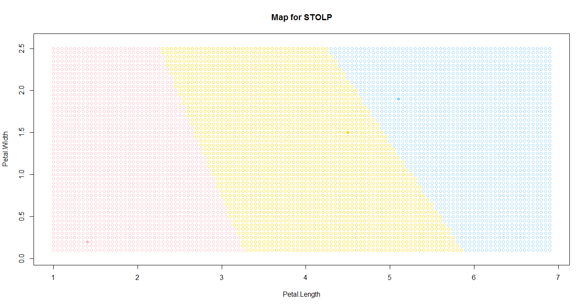
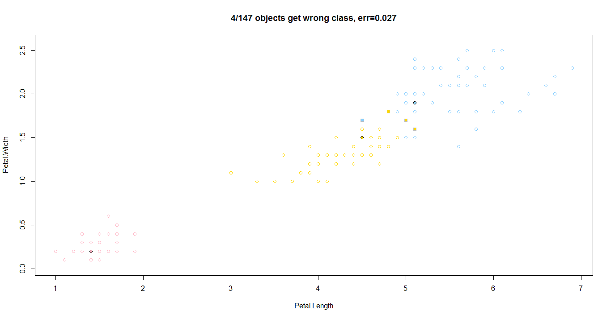
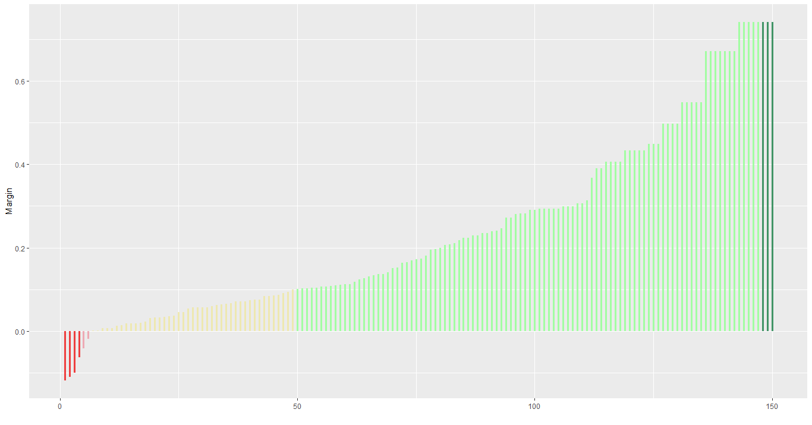

[К меню](https://github.com/Inc1ementia/ML1)

# Метод STOLP

*Метрические методы обучения* (similarity-based learning, distance-based learning) — методы, основанные на анализе сходства объектов. Для формализации понятия сходства вводится *функция расстояния* в пространстве объектов X.

Метрические алгоритмы относятся к методам ленивого обучения (lazy learning), а также к методам рассуждения по прецедентам (case-based reasoning, CBR).

Отступом (margin) объекта относительно алгоритма классификации, имеющего вид


называется величина


Отступ показывает степень типичности объекта. Отступ отрицателен тогда и только тогда, когда алгоритм допускает ошибку на данном объекте. зависимости от значений отступа обучающие объекты условно делятся на пять типов, в порядке убывания отступа: эталонные, неинформативные, пограничные, ошибочные, шумовые. 

Эталонные объекты имеют большой положительный отступ, плотно окружены объектами своего класса и являются наиболее типичными его представителями.

Неинформативные объекты также имеют положительный отступ. Изъятие этих объектов из выборки (при условии, что эталонные объекты остаются), не влияет на качество классификации. Фактически, они не добавляют к эталонам никакой новой информации. 

Шумовые объекты или выбросы — это небольшое число объектов с большими отрицательными отступами. Они плотно окружены объектами чужих классов и классифицируются неверно.

Простой перебор для отбора эталонов не эффективен, алгоритм STOLP позволяет сократить этот перебор. Результатом работы алгоритма STOLP является разбиение обучающих объектов на три категории: шумовые, эталонные и неинформативные. Если гипотеза компактности верна и выборка достаточно велика, то основная масса обучающих объектов окажется неинформативной и будет отброшена. Фактически, этот алгоритм выполняет сжатие исходных данных.

### Алгоритм

1. Отбросить выбросы

2. Сформировать начальное приближение: из объектов выборки выбрать по одному объекту каждого класса, обладающему среди объектов данного класса максимальной величиной риска либо минимальной величиной риска

3. Наращивать множества эталонов (пока число объектов выборки, распознаваемых неправильно, не станет меньше допустимой ошибки):

   Классифицировать объекты, используя в качестве обучающей выборки начальное приближение

   Пересчитать величины риска для всех объектов выборки без приближения с учетом изменения обучающей выборки

   Среди объектов каждого класса, распознанных неправильно, выбрать объекты с максимальной величиной риска и добавить их к приближению

### Программная реализация алгоритма

```R
addMax <- function(xl,range,margin,name) {
  class <- range[which(xl[range]==name,arr.ind=TRUE)]   #выбираем все доступные элементы указанного класса
  m <- which.max(margin[class])    #находим объект, максимальный по отступу
  return (class[m])
}


STOLP <- function(xl,algo,l0,delta) {
  l <- dim(xl)[1]
  n <- dim(xl)[2]
  items <- c(1:l)   #список всех предметов выборки
  classes <- names(colors)   #названия всех классов
  clCount <- length(classes)   #количество классов
  margin <- array(0.0,l)    #массив для отступов
  for (i in 1:l) {
    res <- algo(xl,items,i)   #получаем массив параметров
    class <- which(classes==xl[i,n],arr.ind=TRUE)   #выбираем класс самого объекта
    margin[i] <- res[class]-max(res[-class])   #отступ: свой класс - лучший чужой
  }
  data <- data.frame(x=1:l,y=margin[order(margin)])   #отсортированный массив отступов
  items <- which(margin>=delta,arr.ind=TRUE)    #остальные объекты
  omega <- numeric()
  for (i in 1:clCount) {
    omega <- c(omega,addMax(xl[ ,n],items,margin,classes[i]))   #выбираем по одному самому мощному элементу из каждого класса
  }
  for (i in 1:length(omega)) {
    items <- items[which(items!=omega[i],arr.ind=TRUE)]   #убираем из нераспознанных элементов эталоны
  }
  while (length(items)>0) {
     E <- numeric()
     for (i in items) {
       res <- algo(xl,items,i)
       class <- which(classes==xl[i,n],arr.ind=TRUE)
       margin[i] <- res[class]-max(res[-class])
       if (margin[i]<0) {
         E <- c(E,i)   #если отступ отрицательный, то объект - претендент на то, чтобы стать эталоном
       }
     }
     if (length(E)<l0) break   #если объектов меньше l0, то конец алгоритма
     obj <- which.min(margin[E])   #выбираем объект с минимальным отступом
     omega <- c(omega,E[obj])    #и добавляем в список эталонов
     items <- items[which(items!=E[obj],arr.ind=TRUE)]   #после чего убираем его из списка проверяемых объектов
  }
  items <- c(1:l)
  items <- items[-omega]   #число ошибок будем считать по выборке без объектов
  error <- numeric()
  for (i in items) {
    res <- algo(xl,omega,i)    
    class <- classes[which.max(res)]
    if (class!=xl[i,n]) {
      error <- c(error,i)   #если неправильно классифицорвали, то добавляем в список ошибок
    }
  }
  data$col <- ifelse(
    data$x<=length(error),"firebrick2",
    ifelse(
      data$y<delta,"lightpink2",
      ifelse(
        data$y<0.1,"palegoldenrod",
        ifelse(
          data$x>l-length(omega),"seagreen4",
          "palegreen1"
        )
      )
    )
  )
  toDraw <- ggplot(data,aes(x=x, y=y)) +
    geom_segment(aes(x=x,y=0,xend=x,yend=y,colour=col),size=1.3,alpha=0.9) +
    scale_colour_identity() +
    theme(legend.position="none",panel.border=element_blank()) +
    xlab("") +
    ylab("Margin")
  print(toDraw)
  return (omega)   #возвращаем список эталонов
}
```

### Результат работы алгоритма

Результатом работы алгоритма будет следующий график:





Объекты по отступам



[К меню](https://github.com/Inc1ementia/ML1)
