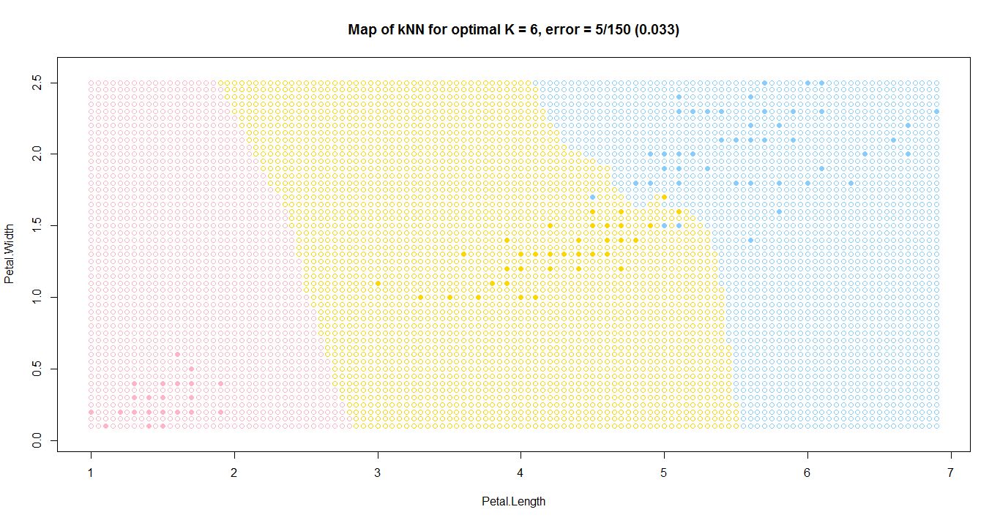

# Метод kNN или Метод k ближайших соседей

### Суть метода

*Метрические методы обучения* — методы, основанные на анализе сходства объектов. (similarity-based learning, distance-based learning). Для формализации понятия сходства вводится *функция расстояния* в пространстве объектов X.

Метрические алгоритмы относятся к методам ленивого обучения (lazy learning), а также к методам рассуждения по прецедентам (case-based reasoning, CBR).

Метод kNN или Метод k ближайших соседей находит k ближайших (т.е. с наименьшим значением функции расстояния) соседей в пространстве признаков и присваивает точку *x* к тому классу, объектов которого больше среди них, т.е. 
$ \omega (i, u) = [i \le k] $

$ \alpha (u;{X}^{l},k)=\arg\max_{y\in Y}\sum_{i=1}^{k}[{y}_{u}^{(i)} =y] $

### Алгоритм

1. Вычислить расстояние до каждого объекта обучающей выборки
2. Объекты обучающей выборки отсортировать по расстоянию до рассматриваемой точки
3. Найти k объектов с минимальным расстоянием
4. Класс классифицируемого объекта - это класс, наиболее часто встречающийся среди k ближайших соседей

### Программная реализация алгоритма

```R
eucDist <- function(u,v) {  #функция расстояния между парой точек
  return (sqrt(sum((u-v)^2)))
}


sortObjbyDist <- function(xl,z,metricFunc=eucDist) {  #функция сортировки массива по расстоянию до z
  l <- dim(xl)[1]
  n <- dim(xl)[2]-1
  dist <- matrix(NA,l,2)
  for (i in 1:l) {
    dist[i, ] <- c(i, metricFunc(xl[i,1:n],z))  #создание списка пар (номер объекта, расстояние до z)
  }
  orderedXl <- xl[order(dist[ ,2]), ]   #сортировка списка объектов
  return (orderedXl)
}


kNN <- function(xl,z,k) {   #функция выбора класса методом kNN
  orderedXl <- sortObjbyDist(xl,z)
  n <- dim(orderedXl)[2]-1
  classes <- orderedXl[1:k,n+1]   #получает список классов для ближайших k объектов
  counts <- table(classes)   #строит из них таблицу количества цветов каждого вида
  class <- names(which.max(counts))   #выбирает тот класс, у которого больше всего представителей
  return (class)
}
```

### Результат работы алгоритма

Результатом работы алгоритма будет следующий график



График поиска оптимального k с помощью метода LOO


Подсветка соседей для случайной точки


