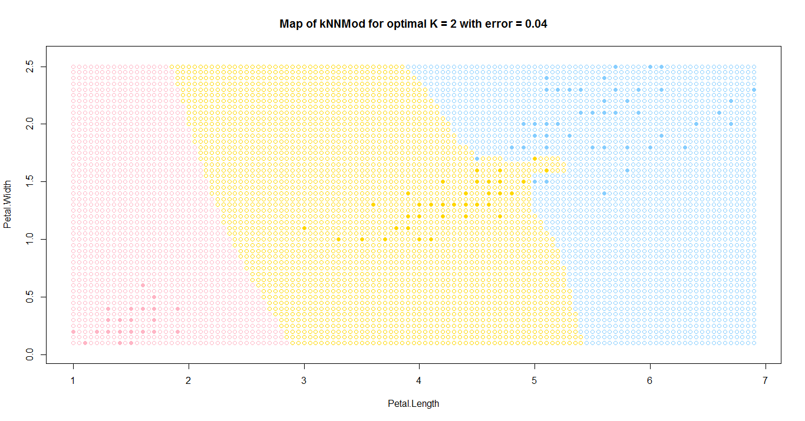
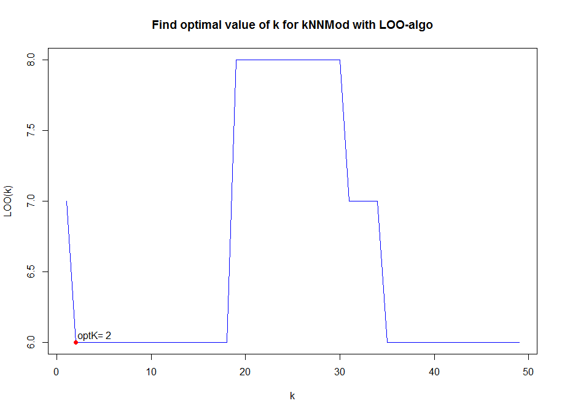
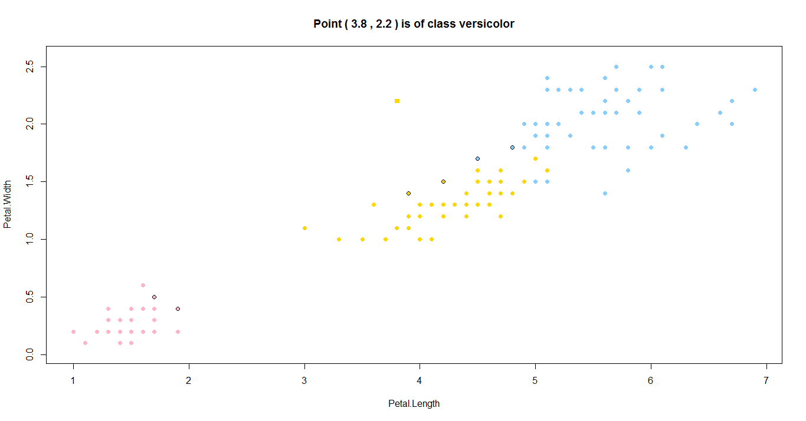

# Метод kNNMod или Модифиетод k ближайших соседей

### Суть метода

*Метрические методы обучения* — методы, основанные на анализе сходства объектов. (similarity-based learning, distance-based learning). Для формализации понятия сходства вводится *функция расстояния* в пространстве объектов X.

Метрические алгоритмы относятся к методам ленивого обучения (lazy learning), а также к методам рассуждения по прецедентам (case-based reasoning, CBR).

Метод kNN или Метод k ближайших соседей находит k ближайших (т.е. с наименьшим значением функции расстояния) соседей в пространстве признаков и объект относится к тому классу, для которого среднее расстояние до k ближайших соседей минимально, т.е. 
$$
\omega (i, u) = [i \le k]
$$

$$
\alpha (u;{X}^{l},k)=\arg\min_{y\in Y}[ \frac{1}{k}\sum_{i=1}^{k}([{y}_{u}^{(i)}=y] \cdot \sqrt{{({x}^{i}-u)}^{2}})]
$$

### Алгоритм

1. Вычислить расстояние до каждого объекта обучающей выборки
2. Объекты обучающей выборки отсортировать по расстоянию до рассматриваемой точки
3. Найти k объектов в каждом классе с минимальным расстоянием
4. Класс классифицируемого объекта - это класс, для которого среднее расстояние до них минимально

### Программная реализация алгоритма

```R
eucDist <- function(u,v) {  #функция расстояния между парой точек
  return (sqrt(sum((u-v)^2)))
}


sortObjbyDist <- function(xl,z,metricFunc=eucDist) {  #функция сортировки массива по расстоянию до z
  l <- dim(xl)[1]
  n <- dim(xl)[2]-1
  dist <- matrix(NA,l,2)
  for (i in 1:l) {
    dist[i, ] <- c(i, metricFunc(xl[i,1:n],z))  #создание списка пар (номер объекта, расстояние до z)
  }
  orderedXl <- xl[order(dist[ ,2]), ]   #сортировка списка объектов
  return (orderedXl)
}


meanDist <- function(xl,z,k,metricFunc=eucDist) {   #функция сортировки расстояний до z
  l <- dim(xl)[1]
  n <- dim(xl)[2]-1
  dist <- matrix(NA,l,2)
  for (i in 1:l) {
    dist[i, ] <- c(i, metricFunc(xl[i,1:n],z))  #создание списка пар (номер объекта, расстояние до z)
  }
  orderedDist <- dist[order(dist[, 2]), ]   #сортировка списка объектов
  return (orderedDist[1:k,2])
}


subclass <- function(xl,type) {   #выбор определённого класса цветов
  n <- dim(xl)[2]
  return (xl[which(xl[ ,n]==type), ])
}


kNNMod <- function(xl,z,k) {   #функция выбора класса методов kNN
  types <- c("setosa","versicolor","virginica")
  n <- dim(xl)[2]-1
  classDist <- c(0,0,0)
  for (i in 1:3) {
    current <- subclass(xl,types[i])   #для каждого класса получает список цветов
    classDist[i] <- mean(meanDist(current,z,k))   #берёт среднее расстояние до ближайших k представителей класса
  }
  class <- types[which.min(classDist)]     #выбирает тот класс, у которого "средний" объект ближе всего к z
  return (class)
}
```

### Результат работы алгоритма

Результатом работы алгоритма будет следующий график



График поиска оптимального k с помощью метода LOO



Подсветка соседей для случайной точки

