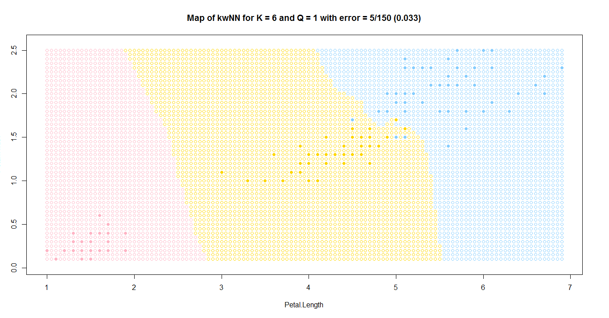
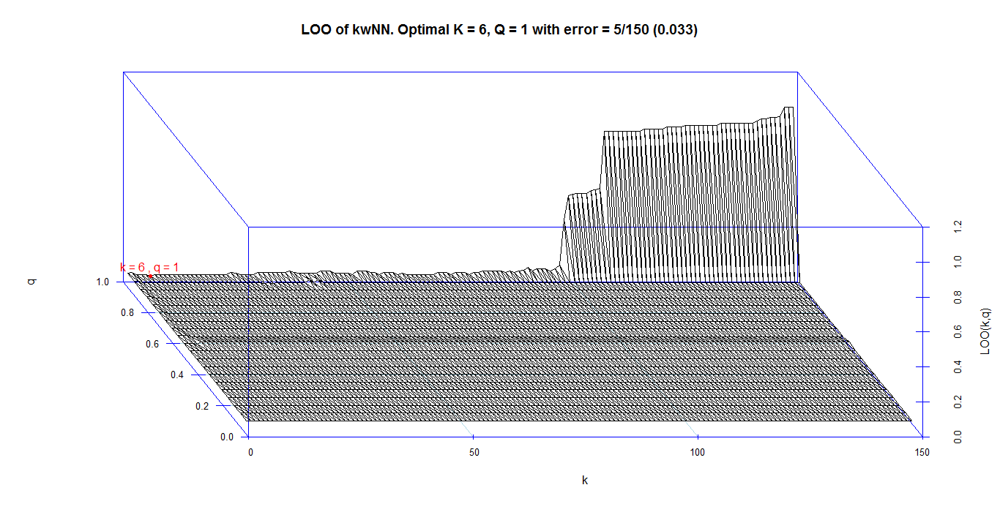

# Метод kwNN или Метод k взвешенных ближайших соседей

### Суть метода

*Метрические методы обучения* — методы, основанные на анализе сходства объектов. (similarity-based learning, distance-based learning). Для формализации понятия сходства вводится *функция расстояния* в пространстве объектов X.

Метрические алгоритмы относятся к методам ленивого обучения (lazy learning), а также к методам рассуждения по прецедентам (case-based reasoning, CBR).

Метод kwNN или Метод k взвешенных ближайших соседей находит k ближайших (т.е. с наименьшим значением функции расстояния) соседей в пространстве признаков и присваивает точку *x* к тому классу, объектов которого больше среди них, при этом оценивая степень их важности для классифицируемой точки с помощью *весовой функции*, т.е. 
$$
\omega (i, u) = [i \le k]w(i)
$$

$$
\alpha (u;{X}^{l},k)=\arg\max_{y\in Y}\sum_{i=1}^{k}[{y}_{u}^{(i)} =y]w(i)
$$

### Алгоритм

1. Вычислить расстояние до каждого объекта обучающей выборки
2. Объекты обучающей выборки отсортировать по расстоянию до рассматриваемой точки
3. Найти k объектов с минимальным расстоянием
4. Посчитать веса для k ближайших объектов
5. Класс классифицируемого объекта - это класс, для которого значения весов максимальное

### Программная реализация алгоритма

```R
eucDist <- function(u,v) {  #функция расстояния между парой точек
  return (sqrt(sum((u-v)^2)))
}


sortObjbyDist <- function(xl,z,metricFunc=eucDist) {  #функция сортировки массива по расстоянию до z
  l <- dim(xl)[1]
  n <- dim(xl)[2]-1
  dist <- matrix(NA,l,2)
  for (i in 1:l) {
    dist[i, ] <- c(i, metricFunc(xl[i,1:n],z))  #создание списка пар (номер объекта, расстояние до z)
  }
  orderedXl <- xl[order(dist[ ,2]), ]   #сортировка списка объектов
  return (orderedXl)
}


kwNN <- function(xl,z,optK,optQ) {
  orderedXl <- sortObjbyDist(xl,z)
  n <- dim(orderedXl)[2]
  classes <- orderedXl[1:optK,n]   #получает список классов для ближайших k объектов
  counts <- c("setosa"=0.0,"versicolor"=0.0,"virginica"=0.0)
  for (i in 1:optK) {
    counts[classes[i]] <- counts[classes[i]]+qPow[i,optQ];
  }
  class <- names(which.max(counts))   #выбирает тот класс, у которого больше всего представителей
  return (class)
}
```

### Результат работы алгоритма

Результатом работы алгоритма будет следующий график



График поиска оптимальных k и q с помощью метода LOO



Подсветка соседей для случайной точки

