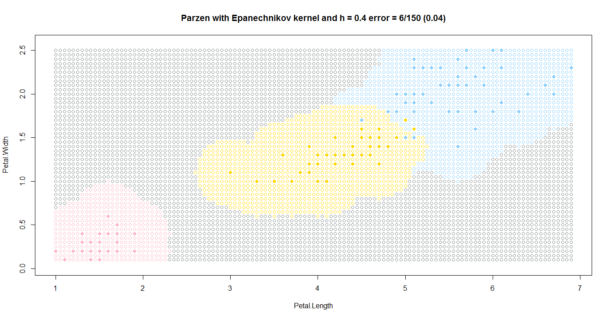
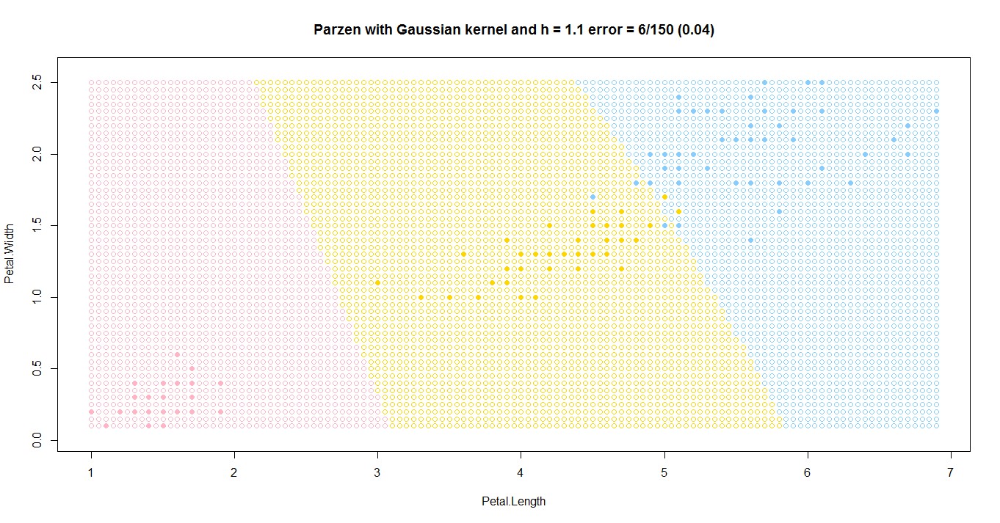
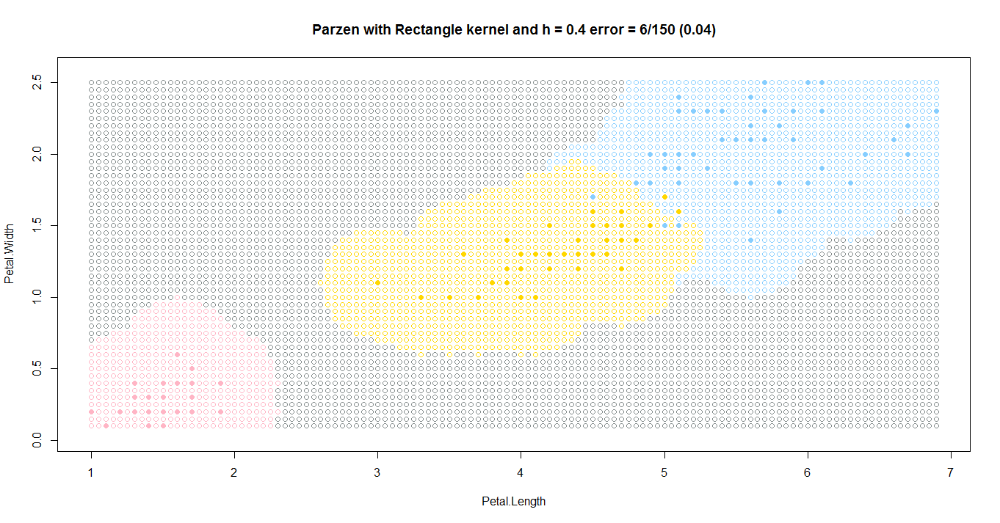
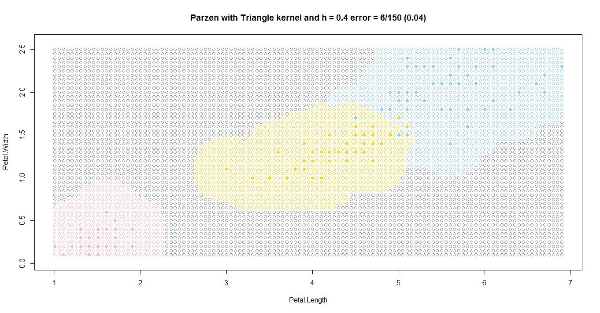
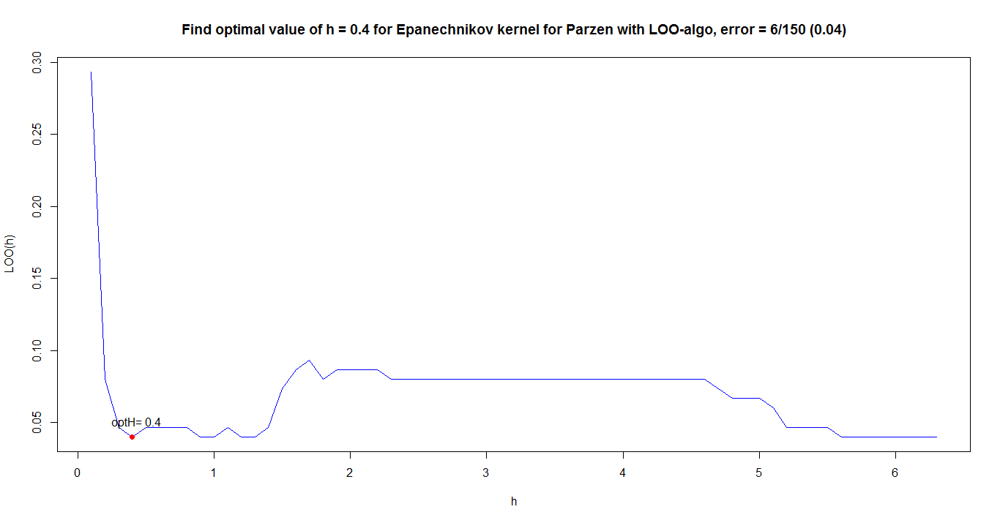
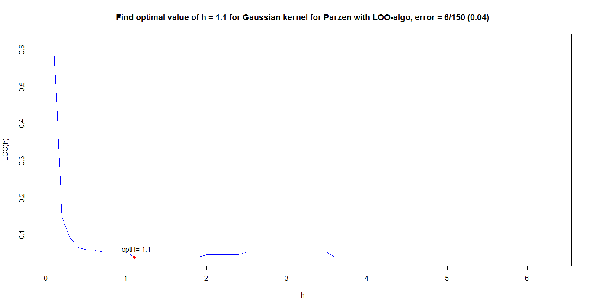
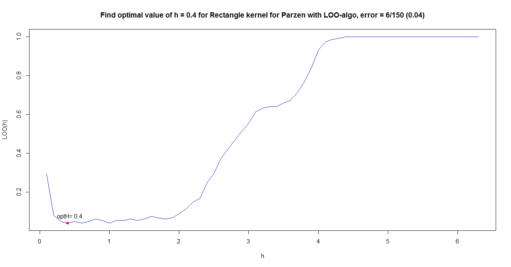
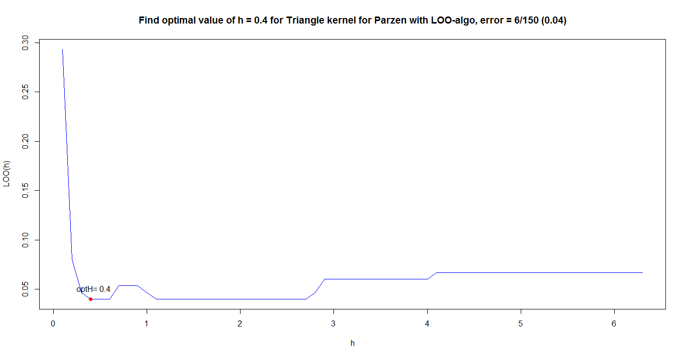

[К меню](https://github.com/Inc1ementia/ML1)

# Метод парзеновского окна

### Суть метода

*Метрические методы обучения* (similarity-based learning, distance-based learning) — методы, основанные на анализе сходства объектов. Для формализации понятия сходства вводится *функция расстояния* в пространстве объектов X.

Метрические алгоритмы относятся к методам ленивого обучения (lazy learning), а также к методам рассуждения по прецедентам (case-based reasoning, CBR).

Метод парзеновского окна основан на восстановлении плотности по имеющейся выборке. В основе подхода лежит идея о том, что плотность выше в тех точках, рядом с которыми находится большое количество объектов выборки, т.е. в методе производится классификация объекта по находящимся на некотором расстоянии от него объектам с весом, зависящим от расстояния. K(z) — произвольная чётная функция, называемая функцией ядра или окна. Ширина окна сильно влияет на качество восстановления плотности и, как следствие, классификации.

$$

$$

В данной программе рассмотрены и реализованы 4 ядра: треугольное, Епанечникова, квартическое и гауссовское.

### Алгоритм

1. Вычислить расстояние до каждого объекта обучающей выборки
2. Объекты обучающей выборки отсортировать по расстоянию до рассматриваемой точки
3. Для всех объектов вычислить значение ядровой функции парзеновского окна
4. Класс классифицируемого объекта - это класс, для которого суммарное значение весов максимальное

### Программная реализация алгоритма

```R
eucDist <- function(u,v) {  #функция расстояния между парой точек
  return (sqrt(sum((u-v)^2)))
}


distSort <- function(xl,z,metricFunc=eucDist) {  #функция сортировки массива по расстоянию до z
  l <- dim(xl)[1]
  n <- dim(xl)[2]-1
  dist <- matrix(NA,l,3)
  for (i in 1:l) {
    dist[i, ] <- c(i, metricFunc(xl[i,1:n],z),xl[i,n+1])  #создание списка пар (номер объекта, расстояние до z)
  }
  orderedXl <- dist[order(dist[ ,2]), ]   #сортировка списка объектов
  return (orderedXl)
}


#LIST OF KERNELS - START
triangleKernel <- function(dist,h) {
  if (dist<=h) {
    return ((h-dist)/h)   #ядро нормированное: 0<=K(x)<=1
  } else {
    return (0.0)
  }
}


rectKernel <- function(dist,h) {
  if (dist<=h) {
    return (0.5)
  } else {
    return (0.0)
  }
}


EpanechnikovKernel <- function(dist,h) {
  if (dist<=h) {
    return (0.75*(1.0-dist^2))
  } else {
    return (0.0)
  }
}


GaussianKernel <- function(dist,h) {
  return (exp(-0.5*(dist*h)^2)*sqrt(h/pi*0.5))
}
#LIST OF KERNELS - END


kernelList <<- c("Triangle"=triangleKernel,"Rectangle"=rectKernel,"Epanechnikov"=EpanechnikovKernel,"Gaussian"=GaussianKernel)


parzen <- function(xl,z,h,kernelType) {		#функция выбора класса методом парзеновского окна
  l <- dim(xl)[1]
  orderedXl <- distSort(xl,z)    #получаем отсортированные расстояния до объектов
  classes <- c("setosa"=0.0,"versicolor"=0.0,"virginica"=0.0,"unknown"=1e-7)   #три класса и неопределённость
  for (i in 1:l) {   #для каждого объекта определяем значение ядровой функции и прибавляем к весу класса
    classes[orderedXl[i,3]] <- classes[orderedXl[i,3]]+kernelType(orderedXl[i,2],h)
  }
  class <- names(which.max(classes))  #относим к тому классу, чей вес больше
  return (class)
}


parzenMulty <- function(xl,z,h,kernels) {		#оптимизированная функция, считает точку сразу по всем ядрам
  l <- dim(xl)[1]
  kLen <- length(h)
  orderedXl <- distSort(xl,z)    #получаем отсортированные расстояния до объектов
  res <- c(1:kLen)
  for (k in 1:kLen) {
    curKernel <- kernels[[k]]   #выбераем k-ое ядро из списка
    H <- h[k]
    classes <- c("setosa"=0.0,"versicolor"=0.0,"virginica"=0.0,"unknown"=1e-7)   #три класса и неопределённость
    for (i in 1:l) {   #для каждого объекта определяем значение ядровой функции и прибавляем к весу класса
      classes[orderedXl[i,3]] <- classes[orderedXl[i,3]]+curKernel(orderedXl[i,2],H)
    }
    res[k] <- names(which.max(classes))  #относим к тому классу, чей вес больше
  }
  return (res)
}
```

### Результат работы алгоритма

Результатом работы алгоритма будут следующие графики для 4-х ядер:









Графики ошибок для окна h для 4-х ядер







[К меню](https://github.com/Inc1ementia/ML1)
