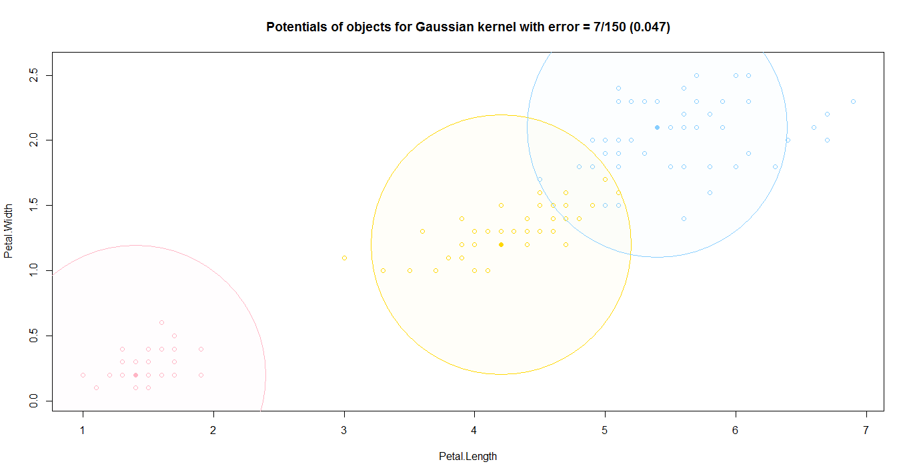
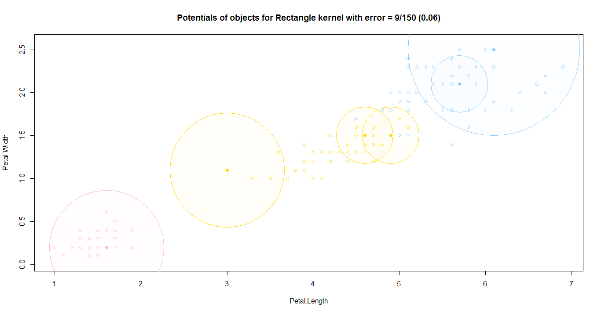
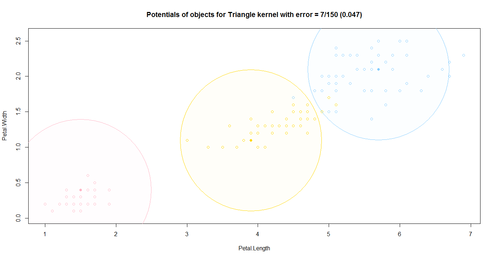

# Метод потенциальных функций

*Метрические методы обучения* (similarity-based learning, distance-based learning) — методы, основанные на анализе сходства объектов. Для формализации понятия сходства вводится *функция расстояния* в пространстве объектов X.

Метрические алгоритмы относятся к методам ленивого обучения (lazy learning), а также к методам рассуждения по прецедентам (case-based reasoning, CBR).

Общая идея метода потенциальных функций иллюстрируется на примере электростатического взаимодействия элементарных частиц.  При классификации объект проверяется на близость к объектам из обучающей выборки. Считается, что объекты из обучающей выборки «заряжены» своим классом, а мера «важности» каждого из них при классификации зависит от его «заряда» и расстояния до классифицируемого объекта. Если в методе парзеновского окна центр окна поместить в классифицируемый объект, то получится метод потенциальных функций:
$$
a( u;\;{X}^{l}) = \arg\max_{y\in Y} \sum_{i:{y}_{i}=y} \gamma_{i} K(\frac{\rho( x,{x}_{i})}{h_{i}})
$$

### Алгоритм

1. Для всех объектов обучающей выборки инициализировать нулевую "яркость"
2. До тех пор, пока процесс не стабилизируется, выбирать один из неправильно классифицируемых объектов и увеличивать его "яркость"
3. Вернуть полученные значения "яркости"

### Программная реализация алгоритма

```R
eucDist <- function(u,v) {  #функция расстояния между парой точек
  return (sqrt(sum((u-v)^2)))
}


#LIST OF KERNELS - START
triangleKernel <- function(dist,h) {
  if (h<=1e-7 && dist<=h) {
    return (1)
  }
  if (dist<=h) {
    return (1-dist/h)   #ядро нормированное: 0<=K(x)<=1
  } else {
    return (0.0)
  }
}


rectKernel <- function(dist,h) {
  if (dist<=h) {
    return (0.5)
  } else {
    return (0.0)
  }
}


EpanechnikovKernel <- function(dist,h) {
  if (h<=1e-7 && dist<=h) {
    return (1)
  }
  if (dist<=h) {
    return (0.75*(1.0-(dist/h)^2))
  } else {
    return (0.0)
  }
}


GaussianKernel <- function(dist,h) {
  return (exp(-0.5*(dist*h)^2)*sqrt(h/pi*0.5))
}
#LIST OF KERNELS - END


kernelList <<- c("Triangle"=triangleKernel,"Rectangle"=rectKernel,"Epanechnikov"=EpanechnikovKernel,"Gaussian"=GaussianKernel)


potentialClass <- function(xlClasses,zIndex,H,kernelType,brightness) {   #классификация объекта с помощью потенциальных функций
  classes <- c("setosa"=0.0,"versicolor"=0.0,"virginica"=0.0,"unknown"=1e-7)   #массив для всех классов и ошибочной классификации
  l <- length(xlClasses)
  brightness[zIndex] <- 0   #обнуляем собственную яркость, чтобы не влиять на себя
  for (i in 1:l) {
    dist <- distMap[i,zIndex]
    w <- kernelType(dist,H[i])*brightness[i]   #потенциал * Ker(rho)
    classes[xlClasses[i]] <- classes[xlClasses[i]]+w  #добавляем к весу класса, из которого взяли объект
  }
  class <- names(which.max(classes))   #выбираем класс с наибольшим суммарным потенциалом
  return (class)
}


getErrors <- function(xl,H,curKernel,bright) {   #определяет список ошибочно классифицируемых объектов
  errors <- numeric()
  l <- length(xl)
  for (i in 1:l) {
    if (xl[i]!=potentialClass(xl,i,H,curKernel,bright)) {
      errors <- c(errors,i)   #добавляем, если класс неверный
    }
  }
  return (errors)
}


potentials <- function(xl,H,kernelIndex,speedUp=FALSE,high=10) {   #построение потенциалов
  curKernel <- kernelList[[kernelIndex]]   #текущее ядро
  l <- dim(xl)[1]
  n <- dim(xl)[2]
  bright <- array(0.0,l)  #массив "яркости"
  optimalSolution <- bright
  optimalResult <- l
  errors <- c(1:l)   #исходно все объекты считаются ошибочно классифицируемыми
  steps <- 0
  perspective <- array(l,l)   #массив для метода оптимального шага
  while (TRUE) {
    if (speedUp==FALSE) {   #используется метод оптимального шага
      for (v in errors) {   #проверяем каждый из ошибочных объектов
        if (xl[v,n]!=potentialClass(xl[ ,n],v,H,curKernel,bright)) {   #если он действительно ошибочный
          bright[v] <- bright[v]+1
          perspective[v] <- length(getErrors(xl[ ,n],H,curKernel,bright))   #узнаём, сколько ошибок можно получить, если усилить именно этот объект
          bright[v] <- bright[v]-1
        }
      }
      mn <- min(perspective[errors])   #выбираем наименьшее число ошибок
      vals <- which(perspective[errors]==mn,arr.ind=TRUE)   #берём список всех объектов, дающих минимум
      optimal <- errors[sample(vals,1)]   #и выбираем случайный из них
      bright[optimal] <- bright[optimal]+1  #и делаем именно его ярче
    } else {   #используется стандартный метод со случайным выбором
      v <- sample(errors,1)   #выбираем случайный объект из ошибочных
      if (xl[v,n]!=potentialClass(xl[ ,n],v,H,curKernel,bright)) {   #если он ошибочный
        bright[v] <- bright[v]+1   #то делаем его ярче
      }
    }
    errors <- getErrors(xl[ ,n],H,curKernel,bright)   #обновляем список ошибочно классифицируемых объектов
    if (length(errors)<optimalResult) {   #если их стало меньше, чем на прошлых шагах
      optimalSolution <- bright   #запоминаем текущие потенциалы
      optimalResult <- length(errors)   #и ошибку
    }
    if (max(bright)==high || length(errors)<5) break   #чтобы не работать слишком долго
    steps <- steps+1
    print(paste0("On step ",steps," get error ",length(errors)))
  }
  return (c(optimalResult,optimalSolution))
}
```

### Результат работы алгоритма

Результатом работы алгоритма будут следующие графики для 4-х ядер:






